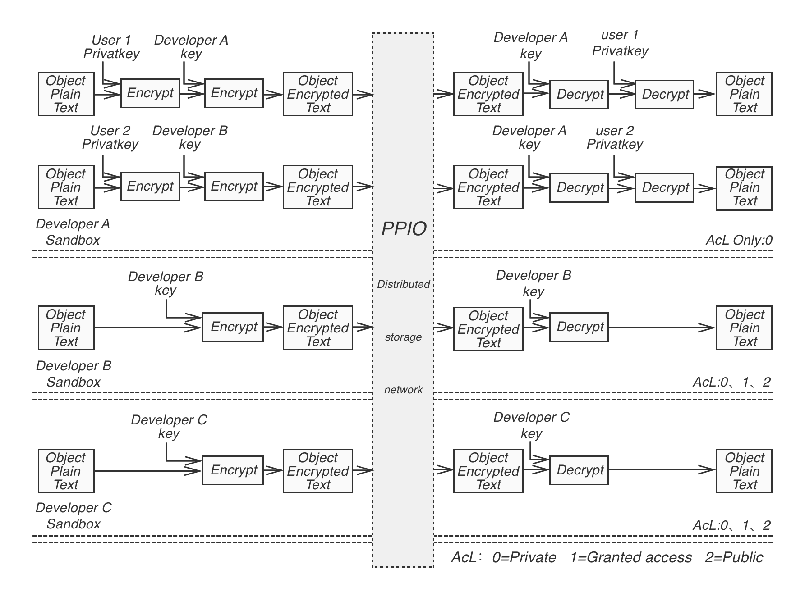

# Interface Layer

One of core design goals of PPiO is to provide programmable distributed storage, that can also be called Decentralized Storage as a Service (DSaaS), In order to be more friendly to developers, it provides:

- **SDK：** Provide high level APIs on various platforms, such as iOS, Android, Mac, Windows, etc.
- **Web API：** Facilitate the developers to develop web based applications.
- **JSON-RPC interface：** Allow DApps to make calls to functionalities on the distributed nodes, enable easy integration of PPIO’s storage system.

## App sandbox
PPIO can support a large number of applications running concurrently in its storage network. Developers can configure the security of the files in their own applications.

- Each App has its own encryption key.
- App developers can specify how to encrypt data objects in their applications:
	- Encryption using the encryption key of the App only.
	- Encryption using the encryption keys of both the App and the user.
- The owner of an object can configure the object access in three ways:
	- Private, only the owner can access.
	- Sharable, owner can share the access to the object to a number of other users.
	- Public, all users can access the object.
- App developers are responsible of the content of the files in their applications.

Diagram of App sandbox

## API
More details in [API Reference]()
