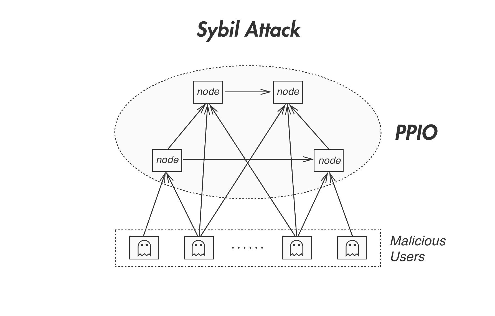
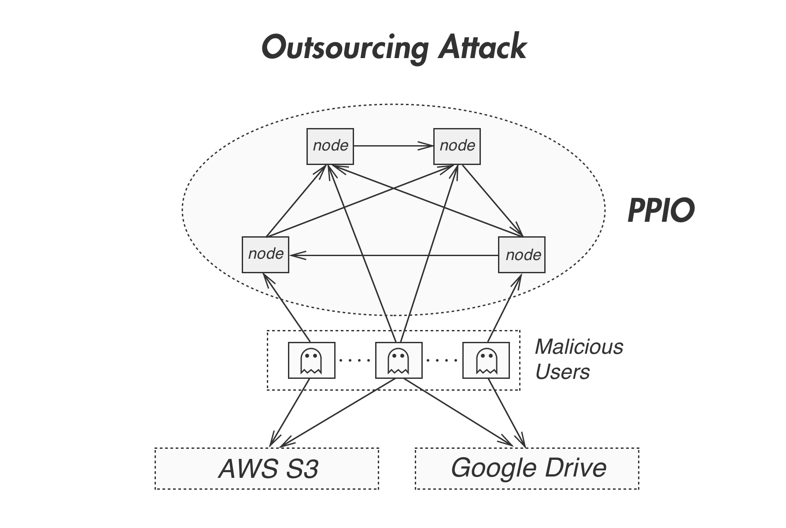
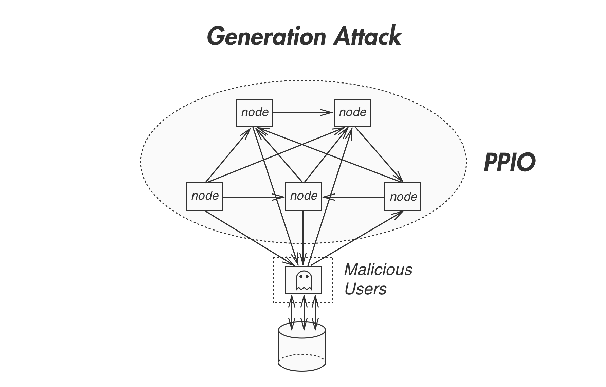
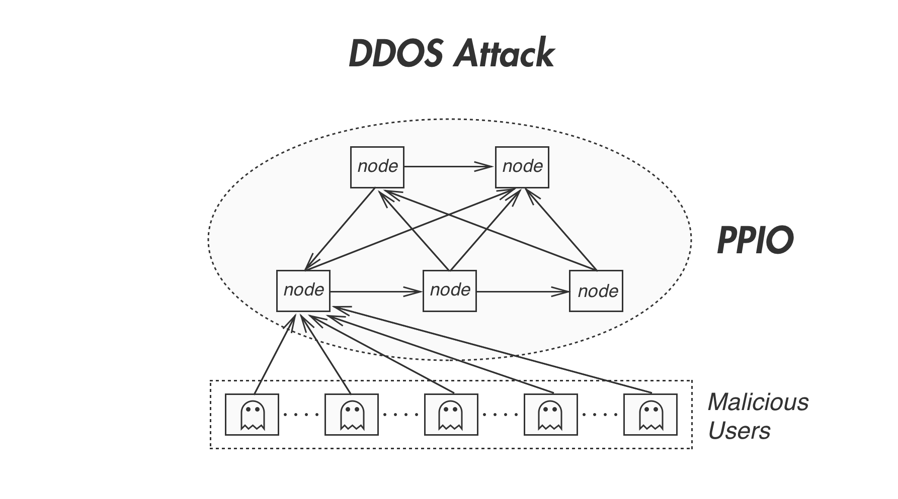
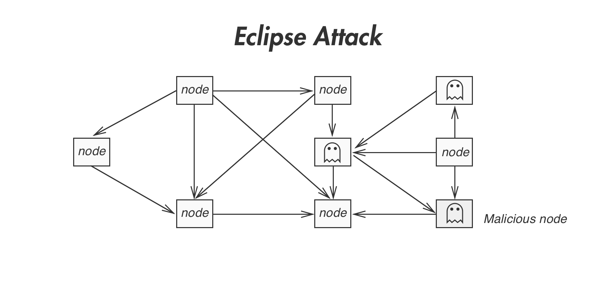

# Five Kinds of Attack

Maintaining security is the most critical task in a distributed storage network. PPIO’s design follows strict security measures to ensure the integrity and reliability of its storage system. This chapter discusses how PPIO defends against common network attacks, including Sybil Attacks, Outsourcing Attacks, Generation attacks that target the decentralized storage system itself, and Distributed Denial of Service (DDoS) Attacks, Eclipse Attacks that target the blockchain.

## Sybil Attacks
As shown in Figure below, Sybil attack takes place when a greedy lessor node creates multiple accounts in the network, and claims to have stored a copy of the data in each account, but in fact it has only stored a single copy. If successful, the attack allows the lessor to receive rewards from multiple accounts unfairly. On the other hand, it can significantly reduce the actual data redundancy in the network, and severely compromise the reliability of the storage system.

Sybil Attack

PPIO’s Proof of Replication (PoRep) and Proof of Spacetime (PoSt) prevent Sybil attacks by requiring each copy of the data to be unique. As a result, each Lessor account is supposed to have stored a different copy. The Verifier In both proofs validates the copy based on its uniquely constructed Merkle tree. As it takes significant amount of time to recreate a copy in order to calculate the correct Merkle tree, both proofs will fail or timeout if the Lessor has not correctly stored its unique copy.

## Outsourcing Attacks
As shown in Figure below, outsourcing attacks take place when lessors claim to have stored copies of the data in their physical storage, but they in fact have stored the data on a third party storage system. These Lessors fulfill the download request by forwarding data from the third-party storage to the user. When multiple lessors follow suit, the third-party storage system may only store a single copy of the data to save cost, and service it to multiple lessors. As a result, the attack reduces the actual data redundancy in the system. In addition, when the third-party storage is a centralized storage system, it increases of the risk of data not getting recovered when there is a failure with the centralized server.

Outsource Attack

PPIO’s PoSt can effectively defend against the generation attacks, as the Lessors need to periodically prove the storage of data assets on their physical storage. The copy of the data each Lessor stores has to be unique, therefore it significantly increases the difficulty for any Lessor node to conduct outsourcing attack, and it reduces the risk of loss of data redundancy in the network.

At the same time, the Verifier in PoSt requires the challenges to be answered within a specified period of time. When the lessor stores data on third party storage, it takes additional time to retrieve the data before they can generate the correct proofs. As a result, the challenge is likely to timeout and the lessor will be punished for failing to provide proofs in time.

## Generation Attacks
As shown in Figure below, generation attacks take place when a lessor pretends to have stored a copy of the data, but in fact it has only stored enough information that can be used to generate the proofs and respond to the storage challenges from a Verifier in real time. If successful, the lessor can claim to have stored large amount of data and get unfair rewards. On the other hand, since user can not download the correct data from the lessor, the reliability of the storage system is significantly degraded.

Generationa Attack

PPIO can effectively prevent generation attacks with the following design:
- PoSt and PoLC require the Lessors to pre-generate the Merkle tree or DAG from the data, in order satisfy the periodical challenges. It is very time consuming to generate the proofs, and the challenges are likely to time out when the Lessor attempts the generate them on demand. Even if the Lessor invests in hardware that enable real time proof generation, the cost would have outweighed the reward. Therefore Lessors are not incentivized to conduct generation attacks.
- In addition, Lessors that store the user data also need to provide download service. In PoD, the Verifier validates the data user downloads from the Lessor. As the Lessor that conducts generation attacks does not keep an actual copy of the data, PoD will always fail, and the Lessor will eventually be penalized for not being able to fulfill download requests. This also takes away the incentives for Lessors to conduct generation attacks.

## Distributed Denial of Service Attacks
As shown in Figure below, DDoS Attacks take place when a large number of network nodes attack a target node at the same time. For example, the attack can cause huge amount of network traffic that overloads the node, and cause it fail to respond to normal service requests.

DDOS Attack

PPIO can effectively prevent DDoS Attacks with the following design:
- For a node to use any service in PPIO, it needs to offer payment (or spend Gas). It will cost the attackers a large sum of money in order to overload a node. Therefore it becomes extremely expensive to conduct DDoS attack effectively in PPIO’s network.
- In PPIO’s consensus mechanism, nodes are being randomly selected to build the next block in the ledger. Unless the attacker attacks all the feasible nodes in the entire network, the operation of PPIO will not be affected. As a result, it is unrealistic for attackers to conduct effective DDoS attacks against PPIO.

## Eclipse Attacks
As shown in Figure below, eclipse attacks take place when attackers isolate a victim node by controlling all the connections to and from the node. As a result, the victim node on longer receives correct information from the rest of the network and therefore can be manipulated by the attackers, and may end up with economic losses.

Eclipse Attack

PPIO can effectively prevent Eclipse Attacks with the following design:
- In PPIO’s blockchain network, the way connections are established among different nodes are not purely based on their peer IDs. Constraints on IP addresses are also applied. As a result, the attackers need to own a huge amount of IP addresses in order to isolate target nodes effectively. Therefore it substantially increase the cost of conducting eclipse attacks.
- The core functionality in PPIO’s network is distributed among different nodes, that makes it harder to attack. For example, there are multiple IndexScheduler nodes and Verifier nodes in the network. Even if the attackers manage to isolate the IndexScheduler node, the Verifier node is still working and can help discover the attack, and vise versa. Therefore the attackers will have to control the majority of the IndexScheduler nodes and Verifier nodes in the network, making it economically infeasible to conduct effective eclipse attacks.
