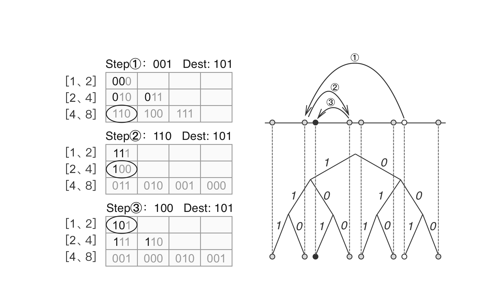

# Distributed Database and Routing
PPIO is a fully decentralized storage and distribution system that requires its database to be also managed in a decentralized fashion. PPIO employs Distributed Hash Table (DHT) to store data and provide routing and lookup services.

In a DHT, each piece of data is bundled with a unique key into a key-value pair. These key-value pairs are distributed and stored among the participating nodes. It avoids the problem with centralized database system, where a failure in the central server leads to the breakdown of the entire network. No single participating node in the DHT is tasked to maintain the entire network. Each node only stores a small part of the database and only needs to maintain information of its adjacent nodes, such design significantly reduces each node’s bandwidth and resource usage. To maintain the reliability of the system, redundancy is also added to the data and stored on multiple nodes, so that a single node failure does not cause loss of data.

There are many different implementations of DHT, some of the commonly used are Chord, Pastry, Tapestry, Dynamo, and Kademlia. PPIO uses Kademlia, so do many other well known P2P projects like PPLive, BitTorrent, eMule, etc.

Kademlia algorithm assigns a unique ID to each participating node. The node ID is also used to calculate distance between nodes and locate key-value pairs. To look up a specific key-value pair in the network, the algorithm steps through the network path and finds nodes closer to the key on every step, until it reaches the node that stores the key-pair. In order to support the lookup, each node needs to store information of a group of other nodes based their distance to it. Such distance is calculated by taking an XOR operation on two Node IDs. Node IDs have the same bit length as the keys used in key-value pairs. Therefore, the distance between node IDs and keys can be calculated in the same way. Since the XOR distance does not take actual geographic distance into account, it is possible for two nodes to reside next to one another in the network even though one of them may be in the United Kingdom, while the other is in the United States.

Lookup in Kademlia DHT

PPIO also adopts an extension of Kademlia - S/Kademlia to improve the security of the network. Via parallel lookup over disjoint paths, the network can sustain attacks even when a large number of nodes are compromised.

With the DHT implementation above, structured data such as file index, statistics on network nodes, and other metadata can be securely saved and easily looked up in PPIO’s distributed network. However, data transfer in its storage network is handled differently, which will be discussed in the next section.
