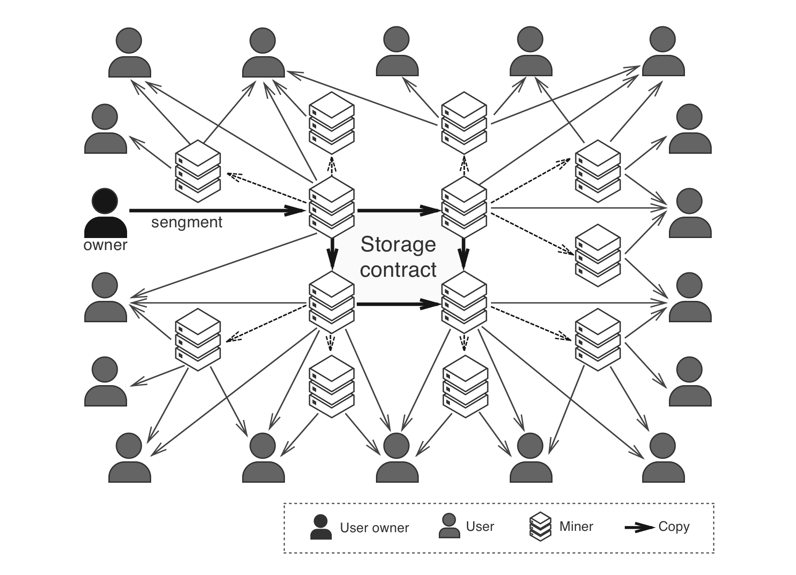

# Optimized Distribution of Popular Content
In a data distribution network, a small number of popular content can consume a large portion of the bandwidth and storage resources. At the same time, download speed of popular content can have huge impact on the overall user experience. Therefore, optimization of popular content distribution is crucial to the network. PPIO provides two optimized scheduling methods for popular content, one that relies on incentivized storage Lessors, and the other enforced by the scheduler. The two methods are designed to work together and ensure efficient distribution of popular content, and maintain a healthy ecosystem of the storage network.

## Proactive Data Population by Incentivized Lessors

As described before, an self-organizing overlay network is established by the participating nodes. When a user node requests for a piece of data, it looks up the resources from the indexing node, and the indexing node returns inforamtion about the Lessor nodes that store the content. At the same time, user node also broadcasts the request to its neighbors to find the resources. Its peers will forward the request to their neighbors upon receiving it. In order to avoid unnecessary burden on the network, the length of the forwarding path is limited. But it also adapts based on the number of nodes that the request has reached. When not enough nodes have been reached, a longer forwarding path is allowed.

When a Lessor node receives the forwarded request, and if it happens to possess the requested resources, it notifies the user and there is a good chance that user will in fact download the data from it, since the Lessor node is in the forwarding path of the user’s neighbors, and thus close to the user. In PPIO, Lessor is incentivized to provide download service as it gets rewarded for doing so.

From the process above, a Lessor is able to track the requests of nearby users, and identify popular content. As storing popular content increases its chance to provide download service and get rewarded, the Lessor will proactively send requests to the scheduler to store the resources of popular content. As many Lessors follow the same strategy, popular data gets quickly populated, and it improves the download speed significantly for the users. When a Lessor discovers that its stored content is no longer popular, it can request to remove the content from its storage. Once approved, the storage can be released and made available to store other resources.

This method is driven by the demand, it incentivizes Lessors to proactively store popular content. It also adapts to the popularity of data in different regions. As PPIO’s overlay network is built by clustering nearby peers, if a piece of content is only popular in a certain region, only the Lessors in the same region will populate it extensively. Lessors in other parts of the network are not affected, thus the overall efficiency of the storage network is maintained.

The algorithm to identify popular content can be customized by each Lessor. Different Lessors in different regions can customize the algorithm differently, in oder to optimize for higher reward.

## Adjusted Scheduling of Popular Content

Lessor nodes that store large amount of popular content are likely to receive more download requests, and fulfilling those requests gets them higher reward. However, too many concurrent downloads will exhaust the bandwidth resource of these Lessors and reduce the download speed of each user. At the same time, it is not fair to the Lessors that store less popular content, that gets much lower reward than the others.

To avoid these problems, the scheduler in the network employs an adjusted scheduling service based on the popularity of the content. Lessors that request to store the most popular content need to pay the scheduler before receiving the resources. The Lessor nodes with higher bandwidth and larger storage still have enough incentives to do so, but they won’t download too much such content, otherwise they can no longer achieve a surplus by providing download service that their bandwidth allow them to.

Dispatch of Popular Content

As shown in the figure above, multiple Lessors store copies of the same data, they need to compete to provide download services to the user. The user always prefers the ones that provide higher download speed. If a Lessor does not have enough bandwidth, users will switch to others. The amount of data it uploads to the users will decrease, which in turn decreases the reward it receives. Therefore, Lessors with lower bandwidth will not be incentivized to store popular content. As a result, popular content are mostly stored on Lessors with higher bandwidth, which in turn improves the speed and experience when user downloads such content.
