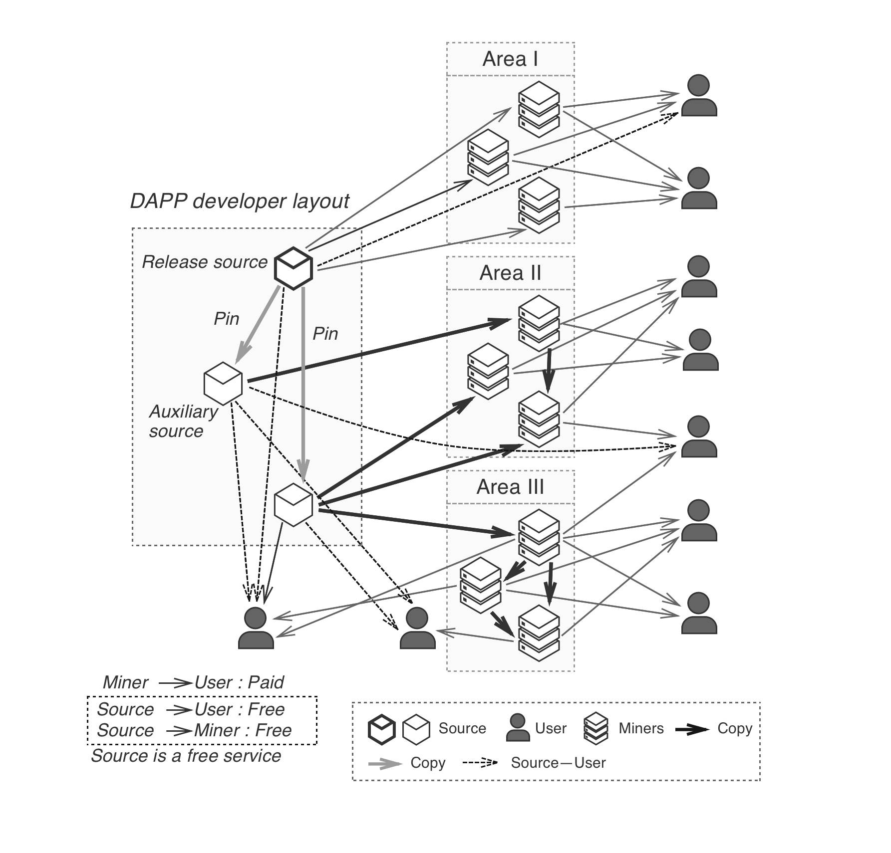

## PCDN
PCDN stands for CDN acceleration with P2P, it utilizes the abundant bandwidth and storage resources of Lessors in P2P network to achieve faster data distribution. PPIO is designed to support PCDN and provide a easy-to-use interface to DApps to accelerate their content delivery.

To start distributing a piece of content, it is published on the source node first. As long as the source node is online, user can download the from it. However, as the number of users downloading from the same source node increases, its available bandwidth gets quickly exhausted and the downloads will slow down. With PCDN, when other Lessor nodes start to store and provide download services for the same piece of content, users will be able to download from multiple peers in the network and enjoy much better user experience.

PCDN Data Flow

There are two ways for applications to leverage PCDN in PPIO’s storage network.

1. Take advantage of content scheduling described in [Optimized Distribution of Popular Content](./Optimized_Distribution_of_Popular_Content.md).As PPIO embeds optimized scheduling of popular content in its overlay network, Lessors will proactively download and store popular data, and provide download services. As a result, data gets copied and distributed across the network where the data is deemed popular. It improves download experience as the number of copies increase. Under this scenario, the Lessors voluntarily distribute the data, therefore there is no need for the application to compensate these Lessors.
2. Enable and configure PCDN directly. PPIO provides a set of APIs to allow DApps to set up PCDN for their content. The applications can specify the number of copies to be maintained in specific parts of the network, or specifc geographic location in terms of country, ISP, state and city, as defined in the P4P database. PPIO will find Lessor nodes in the specified area to store the copies, and provide download services. As the scheduling is specified by the application, it needs to compensate the Lessors’ cost in storage spacetime, scheduling and conducting storage proofs.
