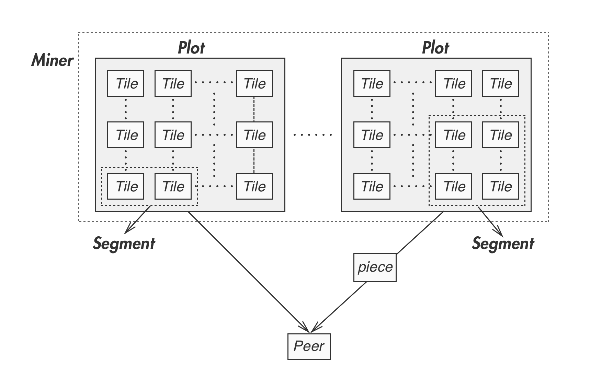

# Data Layer

The next above the physical layer is the data layer. As shown below, there are three types of data structures used in PPIO’s storage network:

The data structures in the Data layer

- **Plot/Tile: the storage capacity unit**
	- Plot can be considered as a virtual drive in PPIO’s storage network, it is initialized when the miner joins the network. Without any data stored, it's the basic unit used in capacity proof - [LPoC](). With data stored, it is the base unit of spacetime proof - [PoSt]().
	- Tile is the smallest unit of verifiable storage in the plot. Its size is 128KB. In PoRep, PoD and PoSt, Tile is used as the basic unit in the verification.

- **Segment: the storage data unit**
	- Segment is the base unit of PPIO’s object oriented storage. An storage object is always divided into multiple segments. To improve privacy protection, PPIO prevents any Lessor node from storing all the segments of an object copy, even if the copy of the object is encrypted. Segment is also the smallest unit in storage scheduling, its size ranges from 128KB to 16MB.

- **Piece: the data transmission unit**
	- The piece is the smallest data unit in PPIO’s network transmission, with the size of 128KB.

In order to maintain reliable data storage, data redundancy is required. PPIO adopts two methods to add redundancy to its stored data.

- **Data Replication:** The original data is replicated into more copies. Although the method introduces large storage overhead, its computation complexity is low and the original data can be easily recovered. It can often be used in storing and distorting popular content.

- **Redundant Coding:** Divide the original data into blocks and encode them with Erasure Code to generate a group of new data blocks that have redundancy embedded. The original data can be recovered if no more than a certain number of the data blocks are lost or corrupted. This method has much lower storage overhead, but it is more computational intensive. It can often be used in storing immutable or less popular content. Reed Solomon is one of the commonly used Erase Code, and can be explained as follows:

	- Let $n$ be number of data blocks in the original data, and $m$ be the number of redundant data blocks, the original data blocks can be denoted as $D_{n \times 1}$.
	- Define a Distribution Matrix as $B_{(n+m) \times n}$, in which the first n rows and n columns form an Identity matrix, and the remaining m rows and n columns are called Vandermonde Matrix or Cauchy matrix.
	- Encoding：Encode $D_{n \times 1}$ and generate the new set of data blocks $DC_{(n+m) \times 1}$, $B_{(n+m) \times n} \times D_{n \times 1} = DC_{(n+m) \times 1}$;
	- Verification: Decode data blocks $B^{-1}{n \times (n+m)} \times DC{(n+m) \times 1} = D'{n \times 1}$. If $D'{n \times 1}==DC'_{n \times 1}$ data is correctly decoded, otherwise data loss or corruption has occurred, and the original data needs to be recovered;
	- Correction: Assume there are $m$ number of data blocks that are lost or corrupt in $DC_{(n+m) \times 1}$
		- Get $DC'{n \times 1}$ by removing m rows of corrupt data in $DC{(n+m) \times 1}$
		- Get $B'{n \times n}$ by removing associate dispatch matrix and calculate $B'^{-1}{n \times n}$
		- Get recovered data $D_{n \times 1} = B'^{-1}{n \times n} \times DC'{n \times 1}$
