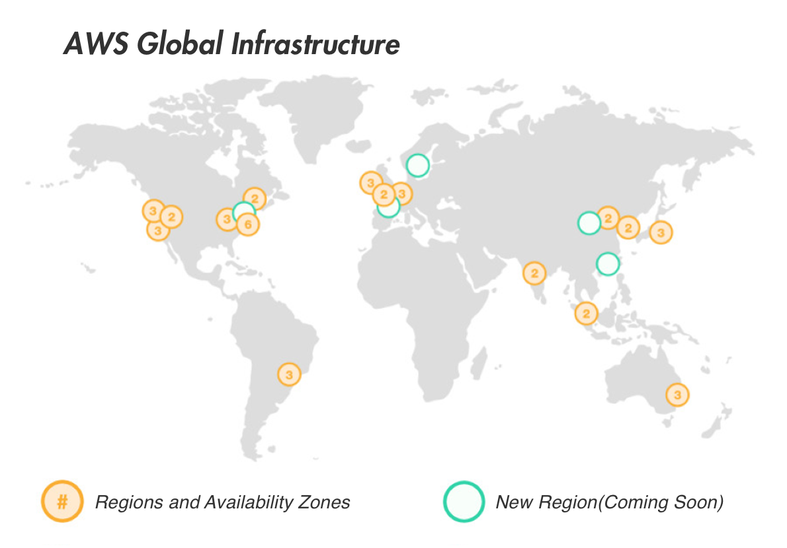

# P2P Self-organizing Overlay networks
Today’s well established storage services, such as Amazon S3, Dropbox, Google Drive, iCloud, etc., store customer data in large-scale data centers. Under cost constraints, each of the services can only deploy a limited number of data centers around the world.The deployment of Amazon AWS data centers is shown in the figure below. Due to the ad hoc nature of the Internet, it is extremely difficult to guarantee fast data transfer everywhere in the world by relying on a handful of data centers. Users in the same region have to compete for the available bandwidth from the data centers. As the number of users grow, their transfer speed and user experience will likely degrade.

AWS global infastructure

PPIO’s distributed storage is a self-organizing, unstructured overlay network, that encourages connection among local peers. Nearby storage Lessors are more likely to be selected to store the data. Similarly, data distribution and retrieval is mostly handled by nearby peers as well. As a result, data transfer can be maintained at much higher speed by fully utilizing local network bandwidth.

With more nodes joining PPIO’s storage network, it becomes easier to each node to find nearby peers with faster connection, for both storage and retrieval. Server bandwidth is no longer a bottleneck, and user growth leads to better speed and experience.

## Establishing a Self-Organizing P2P Network

Every node in PPIO’s network maintains a list of neighboring peers to stay connected with. The list gets updated constantly by dropping disappeared nodes, and adding newly joined neighbors. As a result the list should mostly contain active and fast neighbors. With all the nodes following the same process as described below, the self-organizing P2P overlay network can be established and maintained.

- Start by selecting an initial set of candidate neighbors among the peers it had connections with in the past. Newly joined nodes start with an empty list.
- Obtain new candidate neighbors from the Kademlia DHT. As discussed in the previous section, there is no guarantee that these peers are its geographical neighbors or have fast connection to the node.
- Attempt to make connections to the above two sets of candidate nodes, the number of connections can not exceed a given limit. Each of the connected nodes is now considered a neighbor.
- Obtain new candidates repeatedly, by looking up neighbor's neighbors.
- Probe and evaluate the transmission speed of each new candidate repeatedly, in a round robin fashion, rank the candidates based on the evaluation.
- Eliminate neighbors that have low speed connection to the node or are no longer reachable.
- Select candidates ranked at the top to replace eliminated neighbors.
- Repeat the entire process repeatedly.

To support the above process, each node needs to maintain two real time list, a list of current neighbors, and a list of neighbor candidates. In addition, each node also maintains a list of the past neighbors. These are essential to node selection in the overlay network.

## Prioritization of Neighbors in Lessor Selection

When user uploads data to PPIO's storage network, its neighbors are prioritized when selecting storage Lessors to store the data. A large percentage of the copies of the data are stored on the neighboring Lessors with faster connection to the user, in order to achieve higher transfer speed during storage and retrieval. When enough Lessor nodes join the newtowrk in different regions of the world, high data transfer speed can be maintained around the globe.

## Users In Different Regions
When a user node repeatedly travels between two different regions, PPIO’s design can provide great user experience in both places. When the user node is in location $A$, it finds neighbors in location $A$. When the user node is in a second location $B$, it finds neighbors in location $B$. As a result, its neighbor list or history list contain peers from both locations. If the user node stays in location $A$ for an extended period of time, its neighbor list will contain more peers from location $A$, and vice versa. If the user node travels repeatedly back and forth, the list will contain similar number of peers from location $A$ and $B$. In this way, when user node uploads data, neighbor Lessors from both node will store copies of the data, so that fast data retrieval can be achieved in both places.

## Users of Permanently Changing Regions
When a user node permanently relocates to a different region, PPIO provides a reset feature to help with the reschedule. When reset is initiated, its neighbor list is rebuilt from scratch. New copies are created for existing user data in the network, and these copies are stored by prioritizing the new neighbors. In this way fast data retrieval can be achieved for previously stored data, as well as new data to be stored to the network.
