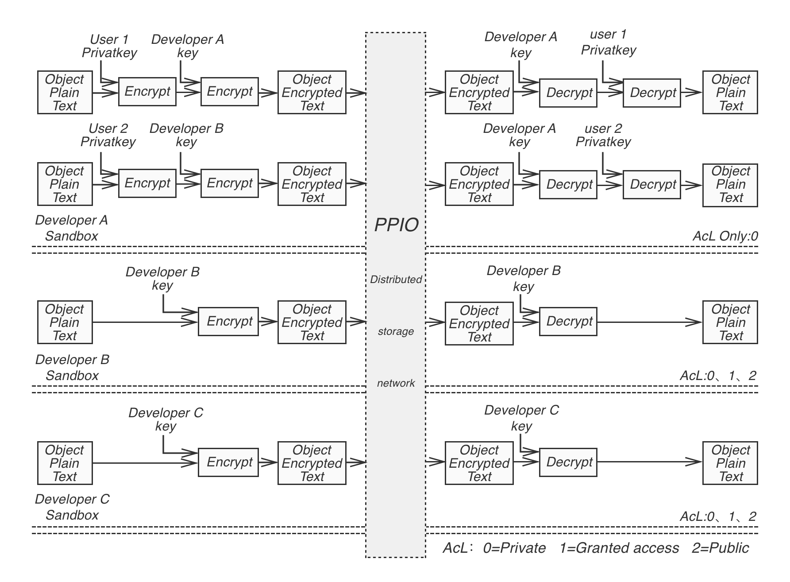

# Seven Layer Architecture

## Physical Layer

Disk storage and network bandwidth are the core components of PPIO’s physical layer. They are the most important resources in PPIO’s storage network, and therefore are also the basis in evaluating each storage miner’s contribution to the network. A miner with large storage capacity but limited bandwidth can contribute more in providing storage service. While miners with less storage but higher bandwidth can contribute more in providing downloading service. miners with large storage and high bandwidth contributes to the network the most and in turn gets rewarded the most.

- **Storage:** Phycial storage may be consisted of Flash drive, Solid State Drive (SSD), Hard Disk Drive (HDD), Tape and Optical Disc (OD), etc. In PPIO’s storage network, different types of storage can play different roles based on their characteristics. For example, SSD can be used to store and provide fast retrieval service for popular content. The life span of the storage media also needs to accommodate the length of the storage contract, for example, tape and optical disk can be used for long time storage while SSD and Flash can cover short term storage uses.

- **Network bandwidth:** In bit/per second, network bandwidth measures the maximum rate of data transfer across a given network path. Network transmission media can include coaxial cable, twisted pair cable, optical fiber cable and wireless connection. Their bandwidth varies a lot, from Kilobits and Megabits per second to Gigabits per second. Network service can be categorized into business and residential networks, and they have very different characteristics in bandwidth usage. For example, use of business bandwidth is usually high during the day, while the use of residential bandwidth stays low. The opposite happens during night time and weekends. PPIO’s distributed storage network adapts to these dynamics in order to make efficient use of the available bandwidth in the network.

## Data Layer

The next above the physical layer is the data layer. As shown below, there are three types of data structures used in PPIO’s storage network:

The data structures in the Data layer

- **Plot/Tile: the storage capacity unit**
	- Plot can be considered as a virtual drive in PPIO’s storage network, it is initialized when the miner joins the network. Without any data stored, it's the basic unit used in capacity proof - [LPoC](Four_Proof_Algorithms.html#proof-of-spacetime-post). With data stored, it is the base unit of spacetime proof - [PoSt](Four_Proof_Algorithms.html#proof-of-spacetime-post).
	- Tile is the smallest unit of verifiable storage in the plot. Its size is 128KB. In PoRep, PoD and PoSt, Tile is used as the basic unit in the verification.

- **Segment: the storage data unit**
	- The segment is the base unit of PPIO’s object-oriented storage. An storage object is always divided into multiple segments. To improve privacy protection, PPIO prevents any miner node from storing all the segments of an object copy, even if the copy of the object is encrypted. A segment is also the smallest unit in storage scheduling, its size ranges from 128KB to 16MB.

- **Piece: the data transmission unit**
	- A piece is the smallest data unit in PPIO’s network transmission, with the size of 128KB.

In order to maintain reliable data storage, data redundancy is required. PPIO adopts two methods to add redundancy to its stored data.

- **Data Copies:** The original data is replicated into more copies. Although the method introduces large storage overhead, its computation complexity is low and the original data can be easily recovered. It can often be used in storing popular content.

- **Redundant Coding:** Divide the original data into blocks and encode them with Erasure Code to generate a group of new data blocks that have redundancy embedded. The original data can be recovered if no more than a certain number of the data blocks are lost or corrupted. This method has much lower storage overhead, but it is more computational intensive. It can often be used in storing immutable or less popular content. Reed Solomon[5] is one of the commonly used Erase Code, and can be explained as follows:

	- Let $n$ be number of data blocks in the original data, and $m$ be the number of redundant data blocks, the original data blocks can be denoted as $D_{n \times 1}$.
	- Define a Distribution Matrix as $B_{(n+m) \times n}$, in which the first n rows and n columns form an identity matrix, and the remaining m rows and n columns are called Vandermonde Matrix or Cauchy Matrix.
	- Encoding：Encode $D_{n \times 1}$ and generate the new set of data blocks $DC_{(n+m) \times 1}$, $B_{(n+m) \times n} \times D_{n \times 1} = DC_{(n+m) \times 1}$;
	- Verification: Decode data blocks $B^{-1}{n \times (n+m)} \times DC{(n+m) \times 1} = D'{n \times 1}$. If $D'{n \times 1}==DC'_{n \times 1}$ data is correctly decoded, otherwise data loss or corruption has occurred, and the original data needs to be recovered;
	- Correction: Assume there are $m$ number of data blocks that are lost or corrupt in $DC_{(n+m) \times 1}$
		- Get $DC'{n \times 1}$ by removing m rows of corrupt data in $DC{(n+m) \times 1}$
		- Get $B'{n \times n}$ by removing associate dispatch matrix and calculate $B'^{-1}{n \times n}$
		- Get recovered data $D_{n \times 1} = B'^{-1}{n \times n} \times DC'{n \times 1}$

## Network Layer

Communication among different nodes in PPIO’s network is based on a set of P2P protocols that include the following:
- Transmission: Supports TCP and UDP based transmission. To improve efficiency and reliability, KCP[1], QUIC[2] and SCTP[3] protocols can also be used.

- Connectivity： NAT traversal technologies are essential to guarantee connectivity. PPIO utilizes STUN (Session Traversal Utilities for NAT) and network relay to help set up connections between nodes behind gateways.

- Load Balance: By using consistent hash, traffic can be evenly distributed to different nodes. It helps reduce the impact of nodes leaving or new nodes joining the network.

- Encryption: By using asymmetric public-private key based signatures, and symmetric data encryption, the identity of message senders can be verified, and the content of the message can be validated.

## Consensus Layer

PPIO’s consensus algorithm is specifically designed for its distributed storage network. It integrates the storage proofs, VRF random selection and BFT consensus.

To further improve its performance and scalability, PPIO also adopts a layered approach in its implementation of the consensus layer. Nodes in the network are grouped into a number of side chains and one master chain. The master chain is formed by selected nodes that are responsible of maintaining the consensus of the entire network. In each side chain, transactions are handled locally but will be aggregated and reported to the master chain periodically.

The figure below shows an example of the layered consensus. Nodes in the P2P are grouped into 3 groups, the master group, the black side chain group and the white side chain group. The details of the design is presented below.

Groups of P2P nodes

- **Master Chain**, nodes in the master chain apply PPIO’s consensus scheme to maintain the entire network.
	- Nodes are selected to join the the master chain based on their storage and bandwidth contribution, once the node's contributions cross a threshold, it is allowed to join the master chain.
		- Each node in the master chain is also a member of a side chain, and it is responsible for recording the transactions and maintaining the ledger of the side chain.   
		- The nodes in the master chain are also responsible for:
			- Creating and managing side chains.
			- Validating and executing storage contracts and transactions.
			- Maintaining the ledger of the master chain.
- **Side Chain**
	- A newly joined node is assigned to a side chain based on network distance and load balancing, to maintain high speed connections among the nodes in the same side chain. At least one of the nodes in the master chain needs to be allocated to each side chain.
	-  Nodes can switch chains to adapt to changes in the network. Side chains with few nodes in it can be combined with other chains.  
	-  Nodes in the side chain are responsible for:
		- Handling storage operations.
		- Conducting storage proofs including PoRep, PoD, PoSt and LPoC.
		- Matching storage contracts between miners and users.
		- Maintaining the ledger of the side chain.
		- Reporting proofs and matched contracts to the master chain.

**Advantages of layered consensus**：
- In a decentralized storage network, nodes take on many different roles and every operation needs to be verified. Layered consensus helps simplify the management of network nodes and avoids the inefficiency of having to sync through the entire network.
- Maintaining low network latency is the key to meet user’s high expectations on storage and download performance. Layered consensus allows the network to be partitioned based on network distance and connection speed. As the storage operations can be handled within each side chain, low latency can be achieved.
- Storage or download of each object requires a contract. The contracts needs to validated, matched, executed, and then recorded in the ledger. Doing all these on a single chain can overload the network. With the layered approach, the side chain can take over part of the workload, it allows the network to scale better and be able to handle large quantities of concurrent transactions.

## Incentive Layer

The foundation of PPIO’s incentive mechanism is formed by the various proofs described before, including [PoRep](Four_Proof_Algorithms.html#proof-of-replication-porep), [PoD](Four_Proof_Algorithms.html#proof-of-download-pod), [PoSt](Four_Proof_Algorithms.html#proof-of-spacetime-post) and [LPoC](Four_Proof_Algorithms.html#light-proof-of-capacity-lpoc). These proofs are strictly derived and rigorously tested, to enable reliable verification of different types of work done by the nodes in the network, so that the right amount of reward can be given to different parties, to maintain a healthy economy and keep it growing.

The smart contract is the basis of PPIO’s reward mechanism:
- **Storage Contract:**
	- User storage contract: User creates a storage contract to store files to the network, which includes information about the storage object, storage duration, number of copies and the amount of payment offered.
	- Miner storage contract: Miner submits storage contract to offer storage service, which includes information about its storage capacity, available duration, amount of acceptable payment. The miner storage contract can also be updated later on.
	- Indexer matches user's and miner’s contracts. When successful, User starts to upload copies of the object to miners. All data transfer is scheduled by the indexer.
- **Download Contract**
	- User download contract: User creates download contract to download files, which includes information about the object to be downloaded and the amount of payment offered.
	- Miner download contract: Miner submits download contract to offer download services, which includes information about the bandwidth provided, duration and amount of acceptable payment.
	- IndexScheduler tries to match the User’s and miner’s contracts. When successful, User starts to download the object from miners. All data transfer is scheduled by the IndexScheduler.

In PPIO’s network, different nodes are getting rewarded based on their roles:
- **IndexScheduler:** When user download or store data, it needs to obtain indexing info from the IndexSchedulers. Therefore the IndexSchedulers will receive indexing reward. When the IndexSchedulers dispatch tasks to the miners, they also receive scheduling reward.
- **Verifier:** All of the storage proofs PoRep, PoD, PoSt and PoC are conducted by the Verifiers, they will receive verification reward.
- **Miner:** Miners not only provide storage space to store user data, but also provide network bandwidth to enable data transfer. The consumption of storage and network bandwidth will be compensated accordingly. At the same time, based on the amount of storage and bandwidth the miners contribute to the network, they will receive rewards periodically.
- **Block Builder:** The nodes that record transactions and maintain the ledger will get rewarded by receiving a portion of the transaction fees. They also receive a reward for adding a new block to the ledger.

## Interface Layer

One of core design goals of PPiO is to provide programmable distributed storage, that can also be called Decentralized Storage as a Service (DSaaS), In order to be more friendly to developers, it provides:

- **SDK：** Provides high level APIs on various platforms, such as iOS, Android, Mac, Windows, etc.
- **Web API：** Facilitates the developers to develop web based applications.
- **JSON-RPC interface：** Allows DApps to make calls to functionalities on the distributed nodes, enable easy integration of PPIO’s storage system.

### App sandbox
PPIO can support a large number of applications running concurrently in its storage network. Developers can configure the security of the files in their own applications.

- Each App has its own encryption key.
- App developers can specify how to encrypt data objects in their applications:
	- Encryption using the encryption key of the App only.
	- Encryption using the encryption keys of both the App and the user.
- The owner of an object can configure the object access in three ways:
	- Private: only the owner can access.
	- Sharable: the owner can share the access to the object to a number of other users.
	- Public: all users can access the object.
- App developers are responsible for the content of the files in their applications.

Diagram of App sandbox

### API
More details in [API Reference](/api/)

## Application Layer

PPIO’s APIs are designed to enable third-party developers to build all kinds of applications, including but not limited to the following:

- **Storage Applications**
  - Private data storage. Due to its decentralized nature, PPIO storage network is very suitable for private network storage applications. Personal data is partioned, encrypted and stored on different nodes to ensure high level of privacy protection. At the same time, access to the data is restricted by user’s private key, making personal data assets even more secure.
  - Enterprise data storage: PPIO can provide significant cost savings for enterprise data storage, while providing high performance services. At the same time, its interfaces are compatible to those of the existing data storage services such as AWS S3, and makes migration to PPIO much easier.

- **DApps:**  
Storing application data on the blockchain is very expensive for decentralized applications. Smart contracts or other applications' data can be stored on external storage by utilizing PPIO’s APIs, in order to achieve significant cost saving.  
For example:
  - Social DApps: PPIO can help validate the identity of users and their messages, it can also help to keep the conversations private.
  - Ads system: Besides storing the advertisement content, PPIO can also help accurately calculating and reporting the statistics of Ad access, such as the click-through-rate. As such data is usually the basis of ads payment, its accuracy and transparency has always been an issue for traditional ads platforms. Businesses may not be able to validate the statistics reported, to make sure they are paying for the actual exposure of the ads, and understand real user preference. PPIO can easily resolve these problems.
  - Traceability Apps: Supply chain or other DApps that require reliable and verifiable data storage.

- **Media Applications:** PPIO provides cost effective bandwidth resource that can help reduce the cost of content distribution significantly. PPIO is also equipped with scheduling and transmission algorithms specifically optimized to achieve smooth streaming playback. Along with its PCDN caching for on-demand content distribution, and cross network acceleration for real-time broadcasting, high quality user experience can be achieved and maintained for media applications. At the same time, PPIO can provide reliable statistics on content consumption that are valuable marketing data for these applications.

- **Data Exchange:** File assets can be traded in PPIO’s network. PPIO can provide ways to match the sellers and buyers, and handle transactions in a secure and reliable way, without requiring an intermediate party. Commonly used applications such as app markets and content platforms can benefit from using PPIO.

- **Data Warehouse:** PPIO can be used as an enterprise data warehouse, to store a huge amount of historical data, and replace traditional unreliable local data storage or expensive cloud storage. Besides enterprise data, PPIO can also be used to store a public database such as a gene pool.

For other types of storage needs, PPIO will also provide the necessary support. In addition, PPIO will be open sourced in the near future. At that time, App enthusiasts and developers will be able to participate in PPIO's development and add support for many more applications.

### Reference
[1] [https://github.com/skywind3000/kcp/blob/master/protocol.txt](https://github.com/skywind3000/kcp/blob/master/protocol.txt)
[2] [R. Hamilton, J. Iyengar, I. Swett, A. Wilk, "QUIC: A UDP-Based Secure and Reliable Transport for HTTP/2" IETF:draft-tsvwg-quic-protocol 2016.](https://tools.ietf.org/html/draft-tsvwg-quic-protocol-02)
[3] [R. R. Stewart and Q. Xie. Stream control transmission protocol (SCTP): a reference guide. Addison-Wesley Longman Publishing Co., Inc., 2001.](https://dl.acm.org/citation.cfm?id=502261)
[4] [Mirrokni, Vahab, Mikkel Thorup, and Morteza Zadimoghaddam. "Consistent Hashing with Bounded Loads." arXiv:1608.01350(2016).](https://arxiv.org/abs/1608.01350)
[5] [https://en.wikipedia.org/wiki/Reed–Solomon_error_correction](https://en.wikipedia.org/wiki/Reed%E2%80%93Solomon_error_correction)
