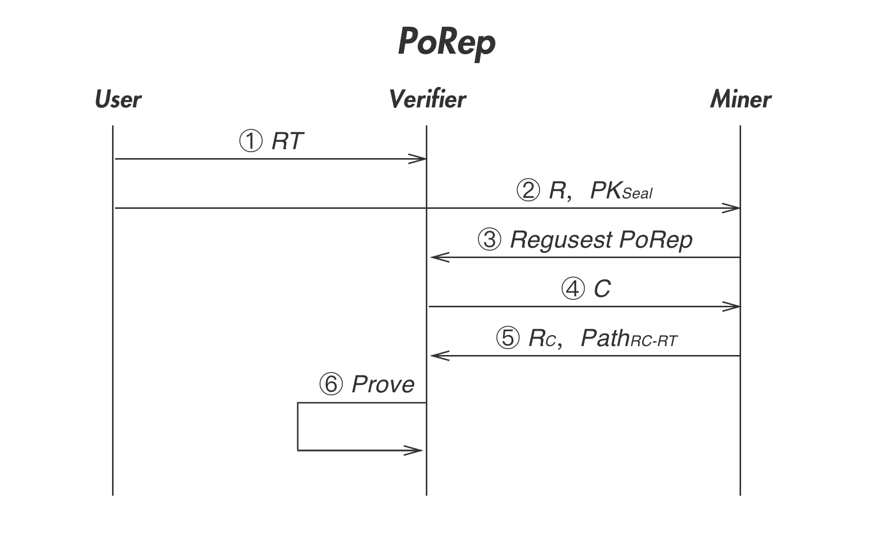
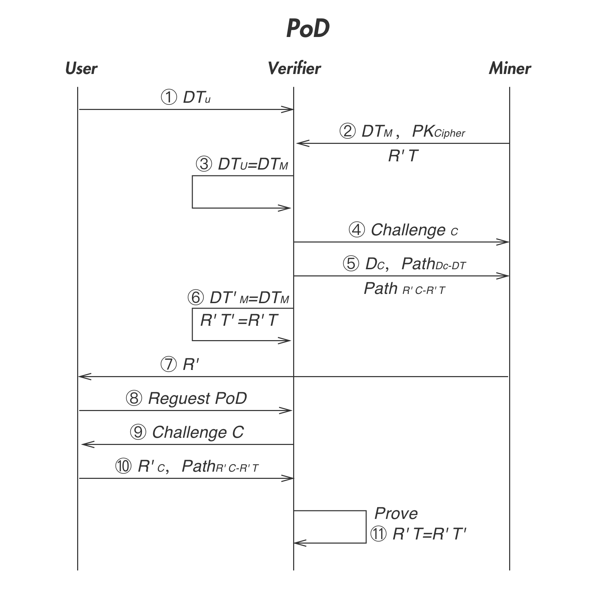
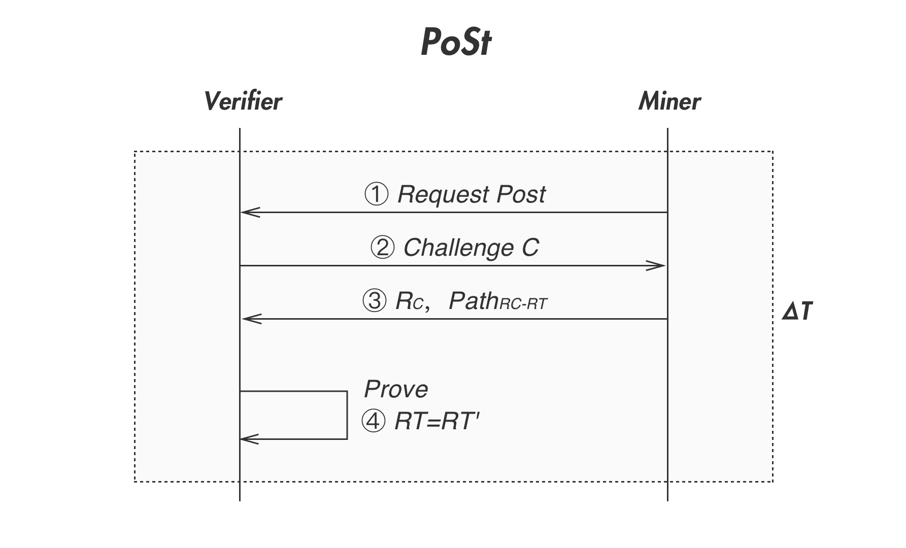
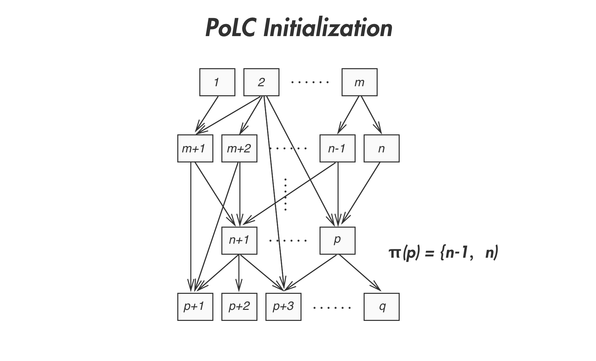
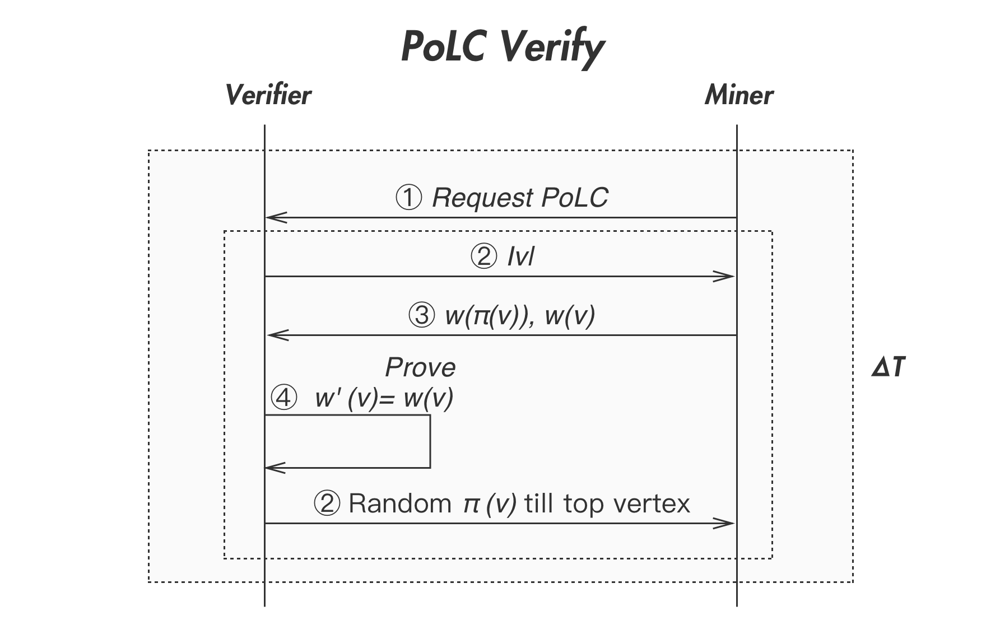

# Four Proof Algorithms

PPIO employs 4 different storage proofs, namely Proof of Replication (PoRep), Proof of Download (PoD), Proof of Spacetime and Light Proof of Capacity (LPoC). These proofs guarantee that the storage provider (miner) correctly replicates the data, and consistently stores the data within the agreed time period. They also ensure that user can successfully download the data any time during the agreed time period. These proofs maintain the integrity and reliability of PPIO's storage system. They will be discussed in details in this section.

Definition of terms in the section：
- **CRH:** Collision-resistant Hashing, a hash function h with which it is difficult to find two different inputs $x$，$x'$, and generate the same output $h(x) == h(x')$.
- **MerkleCRH：** The root hash of a Merkle tree built from collision resistant hashing. Merkle tree can be used as an efficient way to validate if the content of a data block matches the original data.
- **Seal:** An encryption method to ensure that each copy of the data has a unique and independent representation. The encryption process should take substantially longer time than description, to prevent Generation Attacks. AES-256 is a viable option for its implementation.
- **Cipher:** A lightweight encryption method with symmetric keys, used in Proof-of-Download. XOR Cipher is a viable option for its implementation.

## Proof-of-Replication (PoRep)
Proof of Replication (PoRep) provides a way to verify that miner $L$ correctly replicates Data $D$ from User $U$ and stores it in its storage. The process also provides an indirect proof of the bandwidth available to $L$. The procedure of PoRep is described below.

Proof-of-Replication

**Proof-of-Replication**
1. User $U$ generates a Seal key $PK_{Seal}$，applies it to encrypt Data $D$, and generates a unique copy $R=Seal(D, PK_{Seal})$. It also builds a Merkle Tree on top of $R$, calculates the root hash of the tree $RT=MerkleCRH(R)$，and sends $RT$ to Verifier $V$.
2. $U$ transmits $R$ and $PK_{Seal}$ to miner $L$.
3. $L$ requests PoRep challenge from $V$, $V$ accepts the request and sends a random challenge $c$ to $L$, i.e. it challenges the storage of the $c$th data block of $R$.
4. $L$ retrieves $R_{c}$ which is the $c$th block of $R$, and calculates $Path_{RC-RT}$ which contains the hash values of all the Merkle tree nodes between $R_{c}$ and the root node. $L$ returns the following to $V$:
	- $R_{c}$
	- $Path_{RC-RT}$；
5. From received $R_{c}$ and $Path_{RC-RT}$, $V$ generates the Merkle tree root hash $RT'$, if $RT'$ matches the original root hash received from $U$, i.e. $RT' == RT$, the proof has succeeded, otherwise the proof has failed.

## Proof-of-Download (PoD)
Proof-of-Download (PoD) provides a way to verify that Data $D$ has been correctly downloaded from miner $L$ to User $U$. The procedure of PoD is described below.

Proof-of-Download

**Proof of Download**
1. For Data $D$ to be downloaded, User $U$ sends the root hash of its Merkle tree $DT_{U}=MerkleCRH(D)$ to Verifier $V$.
2. Miner $L$ decrypts its stored copy $R$ and obtains data $D$. It then calculates the root hash of its Merkle tree $DT_{L}=MerkleCRH(D)$.
3. $L$ creates a Cipher Key $PK_{Cipher}$, applies it to Data $D$, and generates a ciphered copy $R'=Cipher(D, PK_{Cipher})$. It then calculates the root hash $R'T=MerkleCRH(R')$, and sends the following to $V$:
	- $DT_{L}$
	- $PK_{Cipher}$
	- $R'T$
4. $V$ checks whether $DT_{U}$ is identical to $DT_{L}$. If not, the proof has failed.
5. $V$ sends a random challenge $c$ to $L$, i.e. the storage challenge of the $c$th block of $D$ and $R'$.
6. $L$ retrieves $D_{c}$ which is the $c$th block of $D$ and calculates $Path_{DC-DT}$ which contains the hash values of all the Merkle tree nodes between $D_{c}$ and the root node. $L$ also retrieves $R'{c}$ which is the $c$th block of $R'$ and calculates $Path{R'C-R'T}$ which contains the hash values of all the Merkle tree nodes between $R'_{c}$ and the root node. It then returns the following to $V$:
	- $D_{c}$
	- $Path_{DC-DT}$
	- $Path_{R'C-R'T}$
7. From received $D_{c}$ and $Path_{DC-DT}$, $V$ generates the Merkle tree root hash $DT'{L}$, and verifies that $DT'{L}$ matches the root hash $DT_{L}$ previously received from $L$, i.e. $DT'{L} == DT{L}$. If not, the proof has failed.
8. From received $D_{c}$ and $PK_{Cipher})$, $V$ generates ciphered data block $R'{c}=Cipher(D{c}, PK_{Cipher})$, and calculates the root hash $R'T'$ using $R'{c}$ and received $Path{R'C-R'T}$, and verifies that $R'T'$ matches the root hash previously received $R'T$ from $L$, i.e. $R'T' == R'T$. If not, the proof has failed.
9. $U$ downloads data $R'$ from $L$.
10. $U$ requests proof of download from $V$
11. $V$ sends a random challenge $c$ to $U$, i.e. the storage challenge of the $c$th block of $R'$.
12. $U$ retrieves $R'{c} which is the ${c}th block of content on $R'$, and calculates $Path{R'C-R'T}, which contains the hash values of all the Merkle tree nodes between $R'_{c}$ and the root node, and sends following to $V$:
	- $R'_{c}$
	- $Path_{R'C-R'T}$
13. From received $R'{c}$ and $Path{R'C-R'T}$, $V$ generates the Merkle tree root hash $R'T"$, if $R'T"$ matches the root hash $R'T$ previously received from $L$, i.e. $R'T" == R'T$, the proof has succeeded, and $V$ sends the Cipher key $PK_{Cipher}$ to $U$, so that $U$ can decipher $R'$ to recover data $D$ successfully.

## Proof-of-Spacetime (PoSt)
Proof of Spacetime (PoSt) provides a way to verify that miner $L$ has stored Data $D$ for a given period of time. The process also provides an indirect proof of the storage capacity of $L$. The procedure of PoSt is described below.

Proof-of-Spacetime

**Proof of Spacetime**
1. As described in PoRep procedures, data $D$ is encrypted to obtain a unique copy $R$, $R$ is stored on $L$, its Merkle tree root hash is $RT=MerkleCRH(R)$.
2. $V$ also stores $RT$.
3. At a given time $T$, $L$ requests proof of storage challenge from $V$.
4. $V$ sends a random challenge $c$ to $L$, i.e. the storage challenge on $c$th block of $R$.
5. $L$ retrieves $R_{c}$ which is the $c$th block of $R$, and calculates $Path_{RC-RT}$ which contains the hash values of all the Merkle tree nodes between $R_{c}$ and the root node, and sends the following to $V$:
	- $R_{c}$
	- $Path_{RC-RT}$
6. From received $R_{c}$ and $Path_{RC-RT}$, $V$ generates the Merkle tree root hash $RT'$, and verifies that $RT'$ matches the original root hash stored $RT$, i.e. $RT' == RT$. If not, the proof has failed.
7. Repeat steps 3 to 6 at given time intervals.
8. The series of repeated successful challenges and proofs between $L$ and $V$ generates the successful proof of spacetime.

## Light-Proof-of-Capacity (LPoC)
Light Proof of Capacity (LPoC) provides a way to verify the available storage capacity of miner $L$. The available capacity does not include the storage space already used for existing data. PPIO's lightweight proof reduces the amount of resources wasted in conducting complicated proofs. The procedure of LPoC is broken into two phases, which are described below.

### Initialization Phase

Initialization Phase of Light-Proof-of-Capacity

1. $V$ generates a unique Directed Acyclic Graph (DAG) $G=(N, E)$ for a specific miner $L$, in which N is the set of nodes in G, and E is the set of edges that connect different nodes in G.
2. Let $\pi(n)={n':(n',n)\in E|n'\in N, n\in N}$ be the set of predecessors of node n in G.
3. Let $L_{ID}$ be the identifier of $L$, let $|n|$ be the identifier of node $n$.
4. Let $w(n)=CRH(L_{ID}, |n|, w(\pi(n))$ be the hash value of node $n$, in which $w(\pi(n))=(w(n_{1}),...,w(n_{M}))$ and $n_{1},...n_{M} \in \pi(n)$；
5. $L$ calculates the hash value $w(n)$ for all the nodes in $G$, and stores the values in its available storage, to prepare for challenges from $V$.

### Verification Phase

Verification Phase of Light-Proof-of-Capacity

1. At a given time $T$, $L$ requests PoLC challenge from $V$.
2. $V$ choose a random node $n \in N$, and sends $|n|$ to $L$.
3. Based on received $|n|$, $L$ sends its stored hash values $w(\pi(n))$ of all the nodes in $\pi(n)$ and stored $w(n)$ to $V$
4. From received $w(\pi(n))$, $V$ calculates $w'(n)$ by the formula $w'(n)=CHR(L_{ID}, and |n|, w(\pi(n))$, and verifies that $w'(n)$ is identical to previously received $w(n)$ from $L$. If not, the proof has failed.
5. $V$ randomly chooses one of the predecessors of $n$, repeats steps 2 to 4, until these is no more predecessors to try in any of the predecessor sets.
6. Repeat the procedure from step 1 at given time intervals.
7. The series of repeated successful challenges and proofs between $L$ and $V$ generates the successful proof of capacity for $L$.
