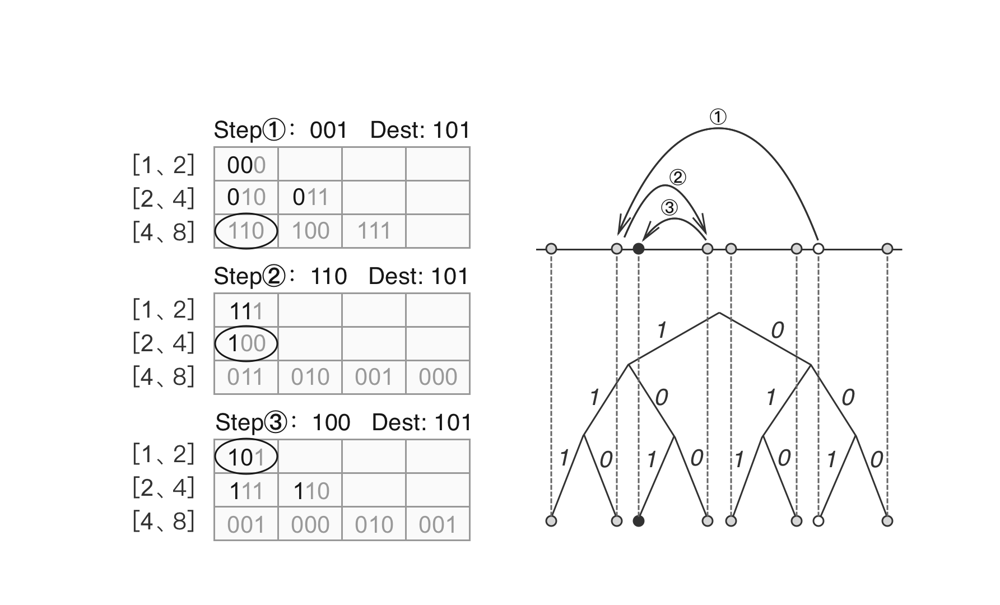
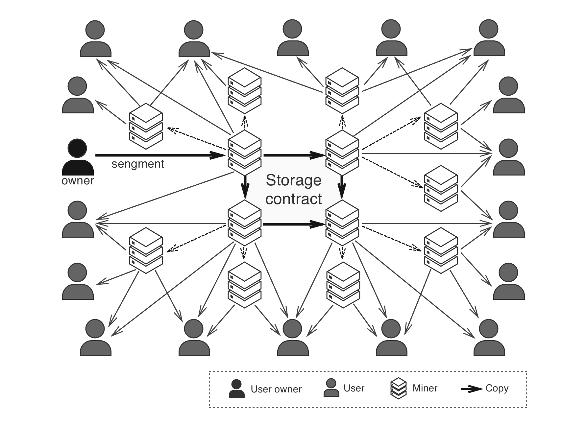
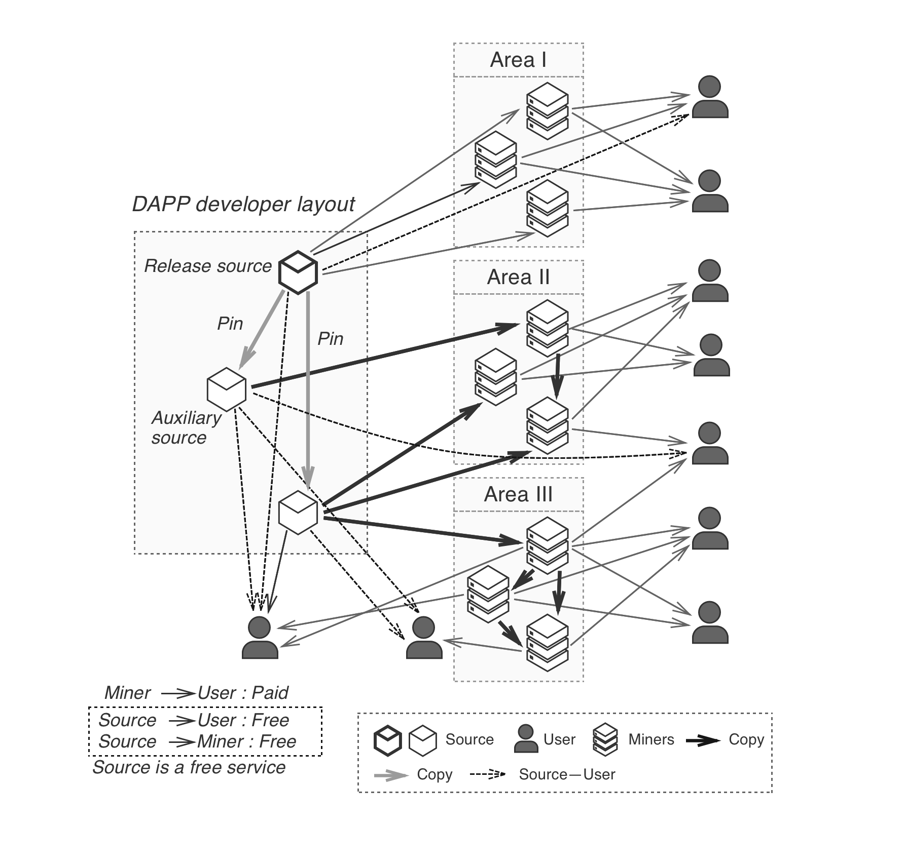

# P2P Network

## Data-Driven Scheduling
In PPIO's system, a storage `Object` is divided into a number of `Segment`, each `Segment` is further divided into a number of `Piece`. For example, one segment can be partitioned into M pieces, and these pieces can be duplicated and stored by N different storage miners. Each of these N miners is also called a `Peer`. A scheduler decides how the M pieces can be downloaded from the N peers, so that the segment can be retrieved in a fast, efficient manner, and avoid duplicated pieces to be downloaded. This process is called **Multi-point Download Scheduling**.

Two data-driven scheduling algorithms are developed to optimize PPIO's data transfer for file download and data streaming[1] use cases, respectively.

### File Download

Summary of the PPIO scheduling algorithm:

1. Multiple virtual connections(Tunnels) are established between the user and each peer with proven resource, in order to improve transmission efficiency. UDP based protocols such as KCP or UDT[2] are attempted first to make the connection. If it fails, TCP based protocols will be used instead to adapt to different types of heterogeneous networks.
2. For each peer, an expected download speed $V_{conn}$ is calculated based on its transmission history. If no history is found, a default empirical value is used.
3. The number of virtual connections on each peer varies, the peer with a higher $V_{conn}$ can have a larger number of initial virtual connections.
4. Based on the partition of the segment, user first sends a download request to a given peer for an arbitrary piece, and the peer responds accordingly by sending user the piece upon receiving the request.
5. When a piece is received from a virtual connection, the estimated download speed $V_{conn}$ is updated, and another remaining arbitrary piece will be requested from the connection immediately, until all the data is downloaded.
6. When a download request times out, the request is cancelled and all connections to the non-responding peer will be closed. The download requests of the remaining pieces will be re-routed to other peers. In this case, the non-responding peer will also be penalized, and the number of connections that can be established from the peer in future downloads is reduced.

Based on the past experience of building high-performing P2P network, PPIO's design allows multiple connections to be established from each peer. It significantly improves the overall transmission efficiency of the network, especially for TCP connections, as it works around the low efficiency problem caused by TCP's conservative flow control.

### Real-time Data Streaming

In addition to supporting efficient file download, PPIO also supports optimized P2P data streaming. PPIO's data-driven scheduler is designed to provide stable real-time streaming performance in an ad-hoc P2P network.[3] The technology has gone through many iterations of trial-and-error optimizations, and is proven to provide high quality user experience to streaming applications such as video-on-demand (VOD) service.

A P2P streaming system has the following unique design characteristics:

- **Sequential download.** In order to maintain smooth streaming playback, subsequent segments and pieces from the current point of playback need to be prioritized in download scheduling.
- **Piece prioritization.** Pieces with the smallest number of duplicates in the network need to be prioritized during download. This may seem counterintuitive, but prioritizing these pieces will help make downloading of the entire segment much faster.
- **Random access.** Many streaming applications allow random access playback such as fast forwarding or seeking. To improve the experience, pieces at pre-defined random access points are prioritized during download. In this case there is a higher chance that necessary pieces are already downloaded to allow the playback to start immediately after seeking.

To achieve the design requirements above, a scheduling algorithm is required to make smart decisions on which peer a piece should be downloaded from, how many peers should be used for simultaneous download, how to set up timer for each peer, how to reschedule remaining pieces and adapt to network changes, etc. The scheduler is also designed to maximize download speed and minimize the overhead of duplicated requests and data transmission. A summary of the scheduling algorithm is as follows:

1. Similar to file download, multiple virtual connections(tunnels) are established with each peer, and the estimated transmission speed $V_{conn}$ is calculated per virtual connection.
2. Pieces to be downloaded are sorted based on their priorities and pre-allocated to available virtual connections by placing them in the corresponding download queues. The estimated arrival time for each piece can be calculated based on the speed of each virtual connection and the remaining pieces to be downloaded in each queue. In general, pieces with higher priority should end up with an earlier estimated arrival time.
3. Step 2 is repeated periodically and all remaining pieces will be re-allocated to accommodate changes in the transmission speed and availability of the virtual connections.
4. After a piece is successfully downloaded, the transmission speed of the virtual connection is updated, and a request is sent immediately to download the next piece in the queue.
5. Urgent pieces can be requested from multiple connections to ensure smooth playback.
6. Other parts of the algorithm works the same way as in normal file download.

**Environment variables of the pre-allocation algorithm**
``` go
// Definition of each virtual connection
struct PeerConn {
    speed := estimated speed of this virtual connection, in KB/s
    queue := virtual download queue of this connection
    isReq := is there pending request  
    lastReqTime := estimated arrival time of the last piece in queue, in ticks
}

pieceSize := size of the piece, in KB
nowTick := current time, in ticks
Peer[] conns := available connections
pieces := pieces sorted by priority
```
**Pseudo code**
``` go
// Algorithm: Pre-schedule for the upcoming Piece, the result of the scheduling exists in the download queue of each tunnel.
//Procedure : PreSchedule()
//Input : conns, pieces, pieceSize, nowT ick Output : connRequestQueues

// Define the time each PeerConn forecast will receive the Piece
uint32 lastRecvTimes[conn.length];
foreach i,conn in conns do
  // Clear previously pre-schedule content
  conn.prescheduleQueue.clear();
  // If there is no request before, the current time is the actual time
  if conn.isReq = true then
    lastRecvTimes[i] <- nowTick;
  else
    lastRecvTimes[i] <- conn.lastReqTime + pieceSize/conn.speed;
  end
end

foreach pieceInx in piece do
  // Define the time each PeerConn forecast will receive the Piece
  uint32 predTimes[conn.length];
  foreach i, conn in conns do
    predTimes[i] <- conn.lastRecvTimes[i] + pieceSize/conn.speed;
  end
  // Find the conn which will receive the piece earlist
  predictInx ← conn minInx(predictRecvTime);
  conns[predictInx].queue.enqueue(pieces[pieceInx]);
  lastRecvTimes[predictInx] += pieceSize/conns[predictInx].speed;
end
connRequestQueues <- conns[].queue;
return connRequestQueues
```

<p style="font-size:14px; text-align:center;">Illustration of pre-allocation</p>

PPIO's P2P transmission network is fully dynamic. Each peer responds to multiple download requests, and potentially to multiple downloading nodes. Each downloading node sends download requests to multiple peers, manages downloaded pieces and deals with potential timeouts and failures from the peers. At the same time, the downloading node itself can be serving download requests, working as a peer to other nodes. By utilizing the two data-driven scheduling algorithms, PPIO's dynamic P2P network is able to handle extremely high volume of concurrent data transmission efficiently.

## Distributed Database and Routing
PPIO is a fully decentralized storage and distribution system that requires its database to be also managed in a decentralized fashion. PPIO employs Distributed Hash Table (DHT) to store data and provide routing and lookup services.

In a DHT, each piece of data is bundled with a unique key into a key-value pair. These key-value pairs are distributed and stored among the participating nodes. It avoids the problem with centralized database system, where a failure in the central server leads to the breakdown of the entire network. No single participating node in the DHT is tasked to maintain the entire network. Each node only stores a small part of the database and only needs to maintain information of its adjacent nodes, such design significantly reduces each node’s bandwidth and resource usage. To maintain the reliability of the system, redundancy is also added to the data and stored on multiple nodes, so that a single node failure does not cause loss of data.

There are many different implementations of DHT, some of the commonly used are Chord, Pastry, Tapestry, Dynamo, and Kademlia. PPIO uses Kademlia, so do many other well known P2P projects like PPLive, BitTorrent, eMule, etc.

Kademlia algorithm assigns a unique ID to each participating node. The node ID is also used to calculate distance between nodes and locate key-value pairs. To look up a specific key-value pair in the network, the algorithm steps through the network path and finds nodes closer to the key on every step, until it reaches the node that stores the key-pair. In order to support the lookup, each node needs to store information of a group of other nodes based their distance to it. Such distance is calculated by taking an XOR operation on two Node IDs. Node IDs have the same bit length as the keys used in key-value pairs. Therefore, the distance between node IDs and keys can be calculated in the same way. Since the XOR distance does not take actual geographic distance into account, it is possible for two nodes to reside next to one another in the network even though one of them may be in the United Kingdom, while the other is in the United States.

<p style="font-size:14px; text-align:center;">Lookup in Kademlia DHT</p>

PPIO also adopts an extension of Kademlia - S/Kademlia to improve the security of the network. These changes are mainly caused by nodes via parallel looking over disjoint paths.  the network can sustain attacks even when a large number of nodes are compromised.

With the DHT implementation above, structured data such as file index, statistics on network nodes, and other metadata can be securely saved and easily looked up in PPIO’s distributed network. However, data transfer in its storage network is handled differently, which will be discussed in the next section.

## P2P Self-organizing Overlay networks
Today’s well established storage services, such as Amazon S3, Dropbox, Google Drive, iCloud, etc., store customer data in large-scale data centers. Under cost constraints, each of the services can only deploy a limited number of data centers around the world.The deployment of Amazon AWS data centers is shown in the figure below. Due to the ad hoc nature of the Internet, it is extremely difficult to guarantee fast data transfer everywhere in the world by relying on a handful of data centers. Users in the same region have to compete for the available bandwidth from the data centers. As the number of users grow, their transfer speed and user experience will likely degrade.


<p style="font-size:14px; text-align:center;">AWS global infastructure</p>

PPIO’s distributed storage is a self-org
anizing, unstructured overlay network, that encourages connection among local peers. Nearby storage miners are more likely to be selected to store the data. Similarly, data distribution and retrieval is mostly handled by nearby peers as well. As a result, data transfer can be maintained at much higher speed by fully utilizing local network bandwidth.

With more nodes joining PPIO’s storage network, it becomes easier to each node to find nearby peers with faster connection, for both storage and retrieval. Server bandwidth is no longer a bottleneck, and user growth leads to better speed and experience.

### Establishing a Self-Organizing P2P Network

Every node in PPIO’s network maintains a list of neighboring peers to stay connected with. The list gets updated constantly by dropping disappeared nodes, and adding newly joined neighbors. As a result the list should mostly contain active and fast neighbors. With all the nodes following the same process as described below, the self-organizing P2P overlay network can be established and maintained.

- Start by selecting an initial set of candidate neighbors among the peers it had connections with in the past. Newly joined nodes start with an empty list.
- Obtain new candidate neighbors from the Kademlia DHT. As discussed in the previous section, there is no guarantee that these peers are its geographical neighbors or have fast connection to the node.
- Attempt to make connections to the above two sets of candidate nodes, the number of connections can not exceed a given limit. Each of the connected nodes is now considered a neighbor.
- Obtain new candidates repeatedly, by looking up neighbor's neighbors.
- Probe and evaluate the transmission speed of each new candidate repeatedly, in a round robin fashion, rank the candidates based on the evaluation.
- Eliminate neighbors that have low speed connection to the node or are no longer reachable.
- Select candidates ranked at the top to replace eliminated neighbors.
- Repeat the entire process repeatedly.

To support the above process, each node needs to maintain two real time list, a list of current neighbors, and a list of neighbor candidates. In addition, each node also maintains a list of the past neighbors. These are essential to node selection in the overlay network.

### Preferred storage miners with a closer network distance

When user uploads data to PPIO's storage network, its neighbors are prioritized when selecting storage miners to store the data. A large percentage of the copies of the data are stored on the neighboring miners with faster connection to the user, in order to achieve higher transfer speed during storage and retrieval. When enough miner nodes join the newtowrk in different regions of the world, high data transfer speed can be maintained around the globe.

### About users who change regions frequently
When a user node repeatedly travels between two different regions, PPIO’s design can provide great user experience in both places. When the user node is in location $A$, it finds neighbors in location $A$. When the user node is in a second location $B$, it finds neighbors in location $B$. As a result, its neighbor list or history list contain peers from both locations. If the user node stays in location $A$ for an extended period of time, its neighbor list will contain more peers from location $A$, and vice versa. If the user node travels repeatedly back and forth, the list will contain similar number of peers from location $A$ and $B$. In this way, when user node uploads data, neighbor miners from both node will store copies of the data, so that fast data retrieval can be achieved in both places.

### If the user permanently relocates to a different region
When a user node permanently relocates to a different region, PPIO provides a reset feature to help with the reschedule. When reset is initiated, its neighbor list is rebuilt from scratch. New copies are created for existing user data in the network, and these copies are stored by prioritizing the new neighbors. In this way fast data retrieval can be achieved for previously stored data, as well as new data to be stored to the network.

## Optimized Distribution of Popular Content
In a data distribution network, a small number of popular content can consume a large portion of the bandwidth and storage resources. At the same time, download speed of popular content can have huge impact on the overall user experience. Therefore, optimization of popular content distribution is crucial to the network. PPIO provides two optimized scheduling methods for popular content, one that relies on incentivized storage miners, and the other enforced by the scheduler. The two methods are designed to work together and ensure efficient distribution of popular content, and maintain a healthy ecosystem of the storage network.

### Storage miners active selection

As described before, an self-organizing overlay network is established by the participating nodes. When a user node requests for a piece of data, it looks up the resources from the indexing node, and the indexing node returns inforamtion about the miner nodes that store the content. At the same time, user node also broadcasts the request to its neighbors to find the resources. Its peers will forward the request to their neighbors upon receiving it. In order to avoid unnecessary burden on the network, the length of the forwarding path is limited. But it also adapts based on the number of nodes that the request has reached. When not enough nodes have been reached, a longer forwarding path is allowed.

When a miner node receives the forwarded request, and if it happens to possess the requested resources, it notifies the user and there is better priority that user will in fact download the data from it, since the miner node is in the forwarding path of the user’s neighbors, and thus close to the user. In PPIO, miner is incentivized to provide download service as it gets rewarded for doing so.


From the process above, a miner is able to track the requests of nearby users, and identify popular content. As storing popular content increases its chance to provide download service and get rewarded, the miner will proactively send requests to the scheduler to store the resources of popular content. As many miners follow the same strategy, popular data gets quickly populated, and it improves the download speed significantly for the users. When a miner discovers that its stored content is no longer popular, it can request to remove the content from its storage. Once approved, the storage can be released and made available to store other resources.

This method is driven by the demand, it incentivizes miners to proactively store popular content. It also adapts to the popularity of data in different regions. As PPIO’s overlay network is built by clustering nearby peers, if a piece of content is only popular in a certain region, only the miners in the same region will populate it extensively. Miners in other parts of the network are not affected, thus the overall efficiency of the storage network is maintained.

The algorithm to identify popular content can be customized by each miner. Different miners in different regions can customize the algorithm differently, in oder to optimize for higher reward.

### Adjusted Scheduling of Popular Content

Miner nodes that store large amount of popular content are likely to receive more download requests, and fulfilling those requests gets them higher reward. However, too many concurrent downloads will exhaust the bandwidth resource of these miners and reduce the download speed of each user. At the same time, it is not fair to the miners that store less popular content, that gets much lower reward than the others.

To avoid these problems, the scheduler in the network employs an adjusted scheduling service based on the popularity of the content. Miners that request to store the most popular content need to pay the scheduler before receiving the resources. The miner nodes with higher bandwidth and larger storage still have enough incentives to do so, but they won’t download too much such content, otherwise they can no longer achieve a surplus by providing download service that their bandwidth allow them to.


<p style="font-size:14px; text-align:center;">Dispatch of Popular Content</p>

As shown in the figure above, multiple miners store copies of the same data, they need to compete to provide download services to the user. The user always prefers the ones that provide higher download speed. If a miner does not have enough bandwidth, users will switch to others. The amount of data it uploads to the users will decrease, which in turn decreases the reward it receives. Therefore, miners with lower bandwidth will not be incentivized to store popular content. As a result, popular content are mostly stored on miners with higher bandwidth, which in turn improves the speed and experience when user downloads such content.

##  ISP Friendly Scheduling
In most P2P networks, a node can transfer data with any other peers, regardless of their location. As a result, a single data transfer can potentially create traffic anywhere in the world, and consumes bandwidth between different Internet Service Providers (ISP), or even between different countries. In 2007, a research institute iPoque carried out an analysis on nearly 3TB of anonymous data sampled from more than a million internet users in Eastern Europe, Southern Europe, Australia and the Middle East.[5] Their studies show that P2P file sharing takes up a significant part of the network bandwidth consumption, accounting for about 49% in the Middle East, and 84% in Eastern Europe. From a global perspective, 95% of the bandwidth at prime time is involved in some forms of P2P data transmission. In recent years, the percentage of P2P traffic has dropped due to a shift in the use pattern of Internet applications. However, with the recent development of blockchain technology and decentralized applications, P2P network traffic is expected to start increasing again. P2P traffic consumes an extraordinary amount of network bandwidth, including international bandwidth. It puts a lot of burden on our internet infrastructure, and significantly increase the cost for ISPs to operate.

As described before, PPIO’s self-organizing overlay network encourages data transfer among neighboring nodes, a large percentage of its traffic is contained within the local network, and the operation cost incurred upon ISPs is greatly reduced. However, the topology of PPIO’s overlay network may not match the ISP topology exactly. Further optimization to reduce unnecessary traffic between ISPs is needed to further improve PPIO’s ability to scale globally.

If the nodes participating in a data transmission happen to be in the close vicinity of each other, it is likely that the traffic will be contained within their area network. As a result, the bandwidth cost will be significantly reduced. This is exactly the principle behind P4P, to fully utilize local network bandwidth in a P2P network.

P4P, or Proactive network Provider Participation for P2P[4], is a method for ISPs and P2P software to optimize connections. It enables peer selection based on the topology of the physical network, in order to reduce traffic on the backbone network, lower the operation cost of network providers, and improve data transfer efficiency.

The implementation of P4P in traditional P2P networks relies on central servers. As PPIO is a completely decentralized network, a decentralized P4P solution is required.

PPIO provides an iP4P interface that allows ISPs to setup and configure P4P in their network, and allows applications to query the information. iP4P is designed to be similar to the iTracker interface in centralized P2P networks, to make it easier to adapt.

- `ip-list`: allows ISPs to provide the list of IPs in their network, it allows nodes in PPIO’s network to be associated with their ISP.
- `policy` allows ISPs to configure the policy for applications to access P4P information.
- `p4p-disance` allows applications to query P4P cost and distance between network nodes.
- `capability` allows applications to query of network resources and capacity of the ISP network.
- `firendly-isp-list` allows applications to query information of friendly ISP, including p4p-distance across different ISPs.

At the same time PPIO introduces a global IP database that is maintained by community. Information in the database can be used to calculate the p4p distance between two nodes in the network, when at least one of them is not within a known ISP network from the iP4P Interface. The database is synced to scheduler(Indexer) nodes and Verifier nodes in the P2P network. Every node in the network can query its own information from the database. The following shows part of the information stored for each node.

```go
message P4PPeerInfo {
    uint32 countryId = 1;   //  Country ID
    uint32 ispId = 2;       //  ISP ID
    uint32 stateId = 3;     // State or Province ID
    uint32 cityId = 4;      // City ID
}
```

When selecting data connections from a given node, the indexing and scheduling node (IndexScheduler) in PPIO’s network checks whether the node can be queried from the iP4P interface:  

- If so, a peer lookup in the node’s ISP network will be conducted first, followed by a lookup in the friendly ISPs, and finally among all other peers. The final peer decision will still be decided based on connection speed as described in [P2P Self-Organizing Overlay Networks](#p2p-self-organizing-overlay-networks). In this way, peers with shorter p4p distances to the node are more likely to be selected to upload or download its data. At the same time, nodes in slower ISPs can still connect to faster outside peers. As a result, unnecessary traffic between different network providers is significantly reduced, and user experience across the entire network is maintained at a high level.

- If not, the p4p distance calculated from global IP database is used in the pre-selection of peers. Similarly the final selection will still be based connection speed.

## PCDN
PCDN stands for CDN acceleration with P2P, it utilizes the abundant bandwidth and storage resources of miners in P2P network to achieve faster data distribution. PPIO is designed to support PCDN and provide a easy-to-use interface to DApps to accelerate their content delivery.

To start distributing a piece of content, it is published on the source node first. As long as the source node is online, user can download the from it. However, as the number of users downloading from the same source node increases, its available bandwidth gets quickly exhausted and the downloads will slow down. With PCDN, when other miner nodes start to store and provide download services for the same piece of content, users will be able to download from multiple peers in the network and enjoy much better user experience.


<p style="font-size:14px; text-align:center;">PCDN Data Flow</p>

There are two ways for applications to implement PCDN in PPIO.

1. Take advantage of content scheduling described in [Optimized Distribution of Popular Content](#optimized-distribution-of-popular-content).As PPIO embeds optimized scheduling of popular content in its overlay network, miners will proactively download and store popular data, and provide download services. As a result, data gets copied and distributed across the network where the data is deemed popular. It improves download experience as the number of copies increase. Under this scenario, the miners voluntarily distribute the data, therefore there is no need for the application to compensate these miners.
2. Enable and configure PCDN directly. PPIO provides a set of APIs to allow DApps to set up PCDN for their content. The applications can specify the number of copies to be maintained in specific parts of the network, or specifc geographic location in terms of country, ISP, state and city, as defined in the P4P database. PPIO will find miner nodes in the specified area to store the copies, and provide download services. As the scheduling is specified by the application, it needs to compensate the miners’ cost in storage spacetime, scheduling and conducting storage proofs.

### Reference
[1] [Yan Huang, Tom Z.J. Fu, Dah-Ming Gao, John C.S. Lui, Cheng Huang, "Challenges, design and analysis of a large-scale p2p-vod system",ACM Sigcomm 2008](http://ccr.sigcomm.org/online/files/p375-huangA.pdf)
[2] [Yunhong Gu, Robert L.Grossma, "UDT: UDP-based data transfer for high-speed wide area networks"](https://www.sciencedirect.com/science/article/abs/pii/S1389128606003057)
[3] [Xinyan Zhang¤, Jiangchuan Liu, Bo Liz, and Tak-Shing Peter Yum, "CoolStreaming/DONet: A Data-Driven Overlay Network for Efficient Live Media Streaming"](https://scinapse.io/papers/1965036080)
[4] [Haiyong Xie, Y. Richard Yang, Arvind Krishnamurthy, Yanbin Liu§ Avi Silberschatz, "P4P: Provider Portal for Applications", ACM SIGCOMM 2008](http://homes.cs.washington.edu/~arvind/papers/p4p.pdf)
[5] [xfiPogue Internet Study 2007](https://www.ipoque.com/news-media/press-releases/2007/ipoque-internet-study-2007-p2p-file-sharing-still-dominates)
