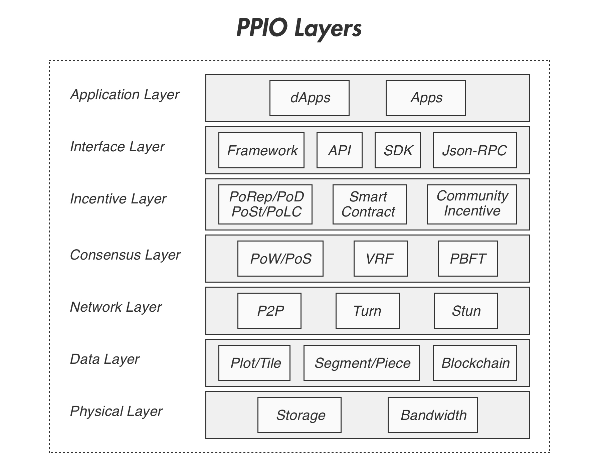

# System Design of PPIO

After the preliminary understanding of PPIO, you will know the technology details and implementation in the following.

## P2P Network
In the traditional Client-Server (C/S) model, the server can easily become the bottleneck of the network when the client population grows. However, a decentralized peer-to-peer network does not rely on any central server to function properly, and can easily tolerate fault and failure of individual nodes.

And PPIO developed a self-governing, elastic and expandable P2P network that allows the participating nodes to easily share idle bandwidth, storage and computation resources. In such a network, multiple copies of the data are distributed and stored on many different nodes. It significantly improves the robustness of the storage system, and allows the client to download data from the closest neighbors on the network. Due to the unique nature of P2P network, more copies of the data lead to faster download speed.

PPIO's P2P network design will be explained in details, including its intelligent data-driven scheduling algorithms, its implementation of the Distributed Hash Table (DHT), its traffic management based on Proactive Network Provider Participation (P4P), and its P2P based content distribution technology(PCDN).

## Attacks and Proofs
The nodes of the traditional P2P network are free to choose join or leave the network, it is difficult to maintain the stability of the network. PPIO incentives the nodes based on their contributions of storage and bandwidth, therefore the nodes incline to stay in the network and make a long and reliable contribution.[1]

However, greedy and malicious nodes would attempt to cheat the network and get rewarded without making proportional contribution, through various types of attacks like Sybil Attack, Outsourcing Attack, Generation Attack, Distributed Denial of Service Attack and Eclipse Attack. These attacks will be explained in details in the [Five Kinds of Attack](./Five_Kinds_of_Attacks.md).

[Four Proof Algorithms](./Four_Proof_Algorithms.md) explains PPIO's Proof of Replication (PoRep), Proof of Download (PoD), Proof of Spacetime (PoSt), and Light Proof of Capacity (LPoC) that are designed to defend the network against all these attacks and maintain the integrity of the system.[2][3] The optimized implementation of the proofs allow them to be deployed and function efficiently at large scale, that enables the incentives system to operate in a secure manner, and help establish a healthy storage market and economy.

## Architecture

PPIO follows a layered system design, to facilitate future expansion, and make it more friendly to developers. As shown in the figure below, PPIO is consisted of seven layers, which are:

The 7 layer architecture of PPIO

1. **Physical Layer:** the hardware layer, that provides underlying storage and bandwidth resources
2. **Data Layer:** basic data units and structures
3. **Network Layer:** P2P network protocol and algorithms for connection, data transfer, load balancing and encryption
4. **Consensus Layer:** PPIO’s consensus scheme and its implementation
5. **Incentive Layer:** manages incentives and rewards based on the role of each node in the network
6. **Interface Layer:** SDK and APIs for the developers and to support the application layer
7. **Application Layer:** Apps or DApps developed by the 3rd party developers

### Reference
[1] [M. Piatek, A. Krishnamurthy, A. Venkataramani, R. Yang, D. Zhang and A. Jaffe, "Contracts: Practical Contribution Incentives for P2P Live Streaming"](https://www.usenix.org/legacy/event/nsdi10/tech/full_papers/piatek.pdf)
[2] [Proof of Replication Technical Report (WIP)](https://filecoin.io/proof-of-replication.pdf)
[3] [S. Dziembowski1, S. Faust, V. Kolmogorov, K. Pietrzak, "Proofs of Space"](https://www.iacr.org/archive/crypto2015/92160192/92160192.pdf)
