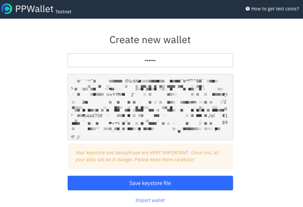
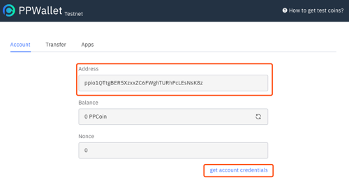
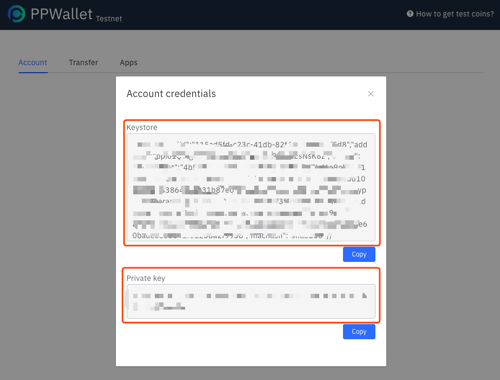
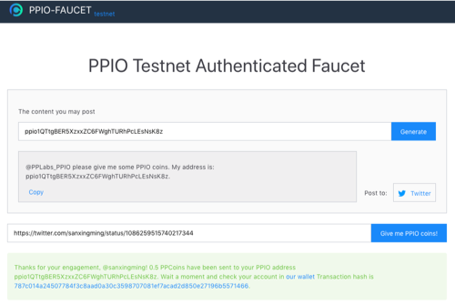

# How to use PPIO CLI

## Overview
**PPIO** stands for PPIO Object Storage Service. The PPIO Command Line Interface (CLI) is a unified tool to manage your PPIO services. With just one tool to download and configure, you can control multiple PPIO services from the command line and automate them through scripts.And the command of PPIO CLI starts with `poss`.

## Step1: Install PPIO CLI
- **Windows:**  
  Download the binary from [here](https://resource.testnet.pp.io/poss/release/windows-amd64/latest/poss.exe).
  ``` powershell
    poss.exe --help
  ```

- **Mac OsX**  
    ``` bash
      curl -o poss https://resource.testnet.pp.io/poss/release/macos/latestla/poss
      chmod +x poss
      ./poss --help
    ```

- Linux:  
    ``` bash
      curl -o poss https://resource.testnet.pp.io/poss/release/linux-amd64/latest/poss
      chmod +x poss
      ./poss --help
    ```
## Step2: Generate a PPIO wallet account and get the keystore file
> PPIO wallet is a blockchain wallet. And if you don't understand the concept of blockchain wallet, there will be a lot of articles on Google.

Go to [PPIO wallet](https://wallet.testnet.pp.io/#/new/create) to generate a PPIO wallet account. And this account can be used not only in the PPIO CLI but also [PPIO demo app](https://github.com/ppio/ppio-demo-desktop) and [PPIO SDK](./sdk/).

**create a PPIO wallet account**  

  

**get your PPIO wallet address**  

  

**get the keystore file and private key of the account**  

  

Now you have got your wallet keystore file.

## Step3: Get some test coins for free
Now there is no coin in your PPIO wallet. You need to go to [our faucet](https://faucet.testnet.pp.io) to get some of our test coins for free.
  

- Enter your PPIO address to generate the content you may post.
- Post the content to Twitter.
- Copy-paste the posts URL of the tweet.
- Click the “Give me PPIO coin” button to get 1 free PPIO coin for testnet!

## Step4: Send test coins to PPIO
Although you already have test coins in your PPIO wallet, if you want to really experience the PPIO CLI, you need to go back to [PPIO wallet page](https://wallet.testnet.pp.io) to recharge some PPIO coins. This involves our underlying system architecture. We will introduce these details in a later article.   


### Step5: Import your user credentials to PPIO CLI and start PPIO service background
- **macOS**  or **Linux**
    ```bash
    # import your wallet user credentials into PPIO CLI
    ./poss init --keystore=[your keystore file absolute path]

    # start the PPIO service background
    ./poss start --daemon --key-passphrase=[passphrase of your keystore]
    ```
    or
    ```bash
    # import your wallet user credentials into PPIO CLI and start the PPIO service background
    ./poss start --daemon --keystore=[your keystore file absolute path] --key-passphrase=[passphrase of your keystore]
    ```
- **Windows**
    ```powershell
    # import your wallet user credentials into PPIO CLI
    poss.exe init --keystore=[your keystore file absolute path]

    # start the PPIO service background
    poss.exe start --daemon --key-passphrase=[passphrase of your keystore]
    ```
    or
    ```powershell
    # import your wallet user credentials into PPIO CLI and start the PPIO service background
    poss.exe start --daemon --keystore=[your keystore file absolute path] --key-passphrase=[passphrase of your keystore]
    ```

### Step6: Upload and download a file using PPIO CLI
Run the following commands in order on your command line terminal.
- **macOS**  or **Linux**
    ```bash
    # create a bucket
    ./poss create-bucket --bucket=test

    # upload a file to PPIO
    ./poss put-object --bucket=test --chiprice=100 --key=/test  --expires=2019-04-01 --body=[your file absolute path]

    # get a file from PPIO
    ./poss get-object --bucket=test --key=/test --chiprice=100 --outfile=[Get file to local path]
    ```
- **Windows**
    ```bash
    # create a bucket
    poss.exe create-bucket --bucket=test

    # upload a file to PPIO
    poss.exe put-object --bucket=test --chiprice=100 --key=/test  --expires=2019-04-01 --body=[your file absolute path]

    # get a file from PPIO
    poss.exe get-object --bucket=test --key=/test --chiprice=100 --outfile=[Get file to local path]

Well! Now that you have completed the uploading and downloading of a file with PPIO. Of course, PPIO can do much more than that. Go to [PPIO CLI Reference](./cli/)
