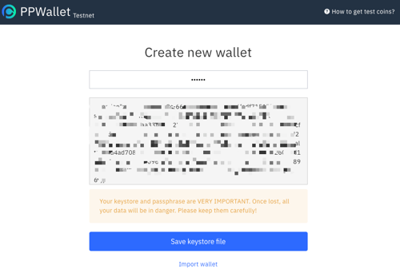
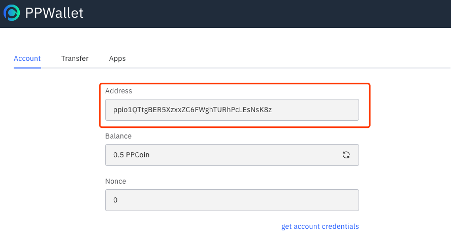
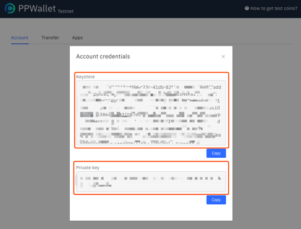
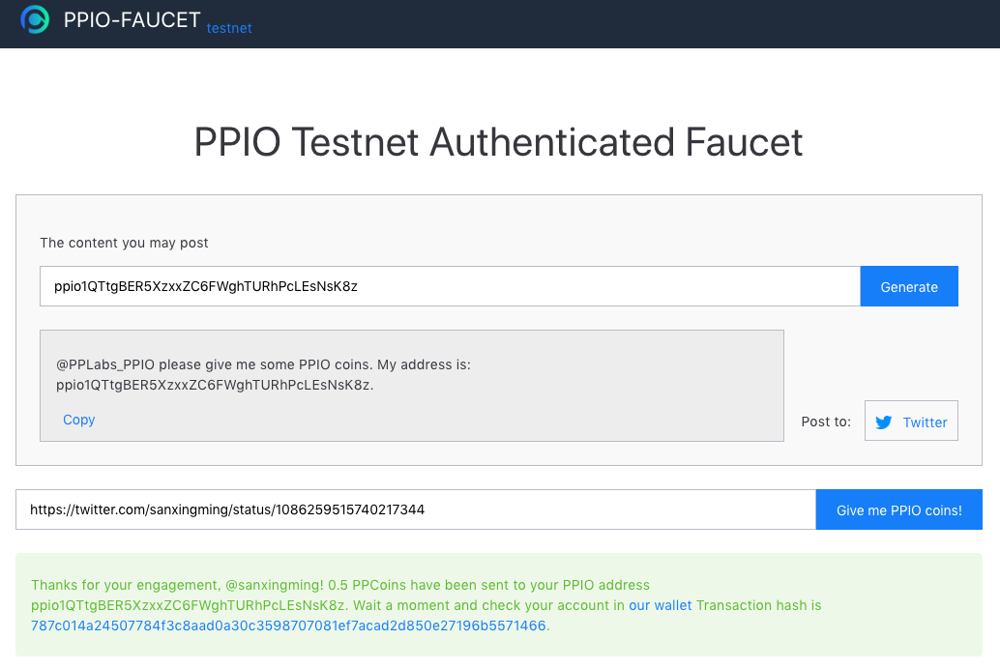
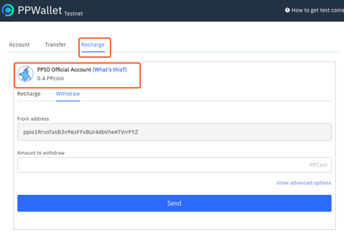
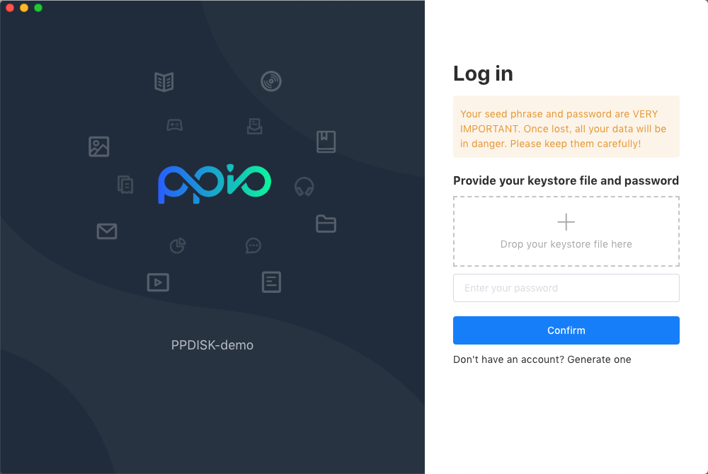
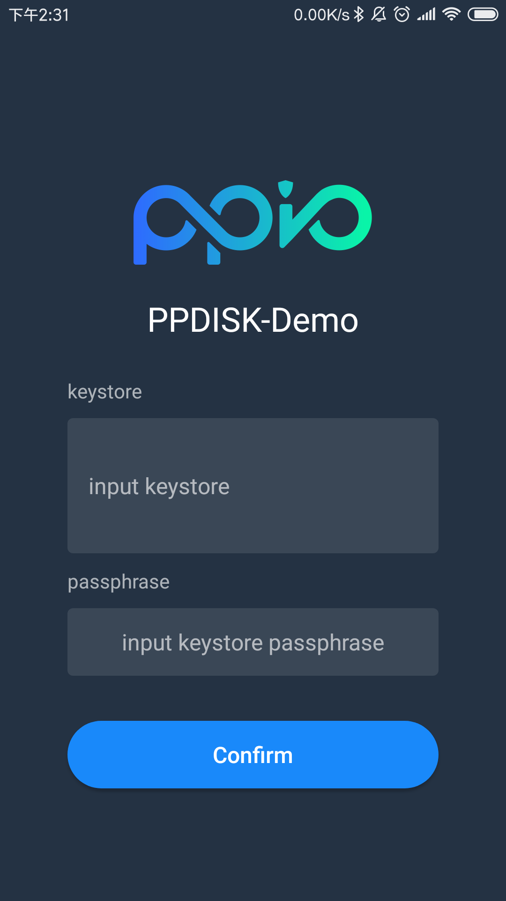
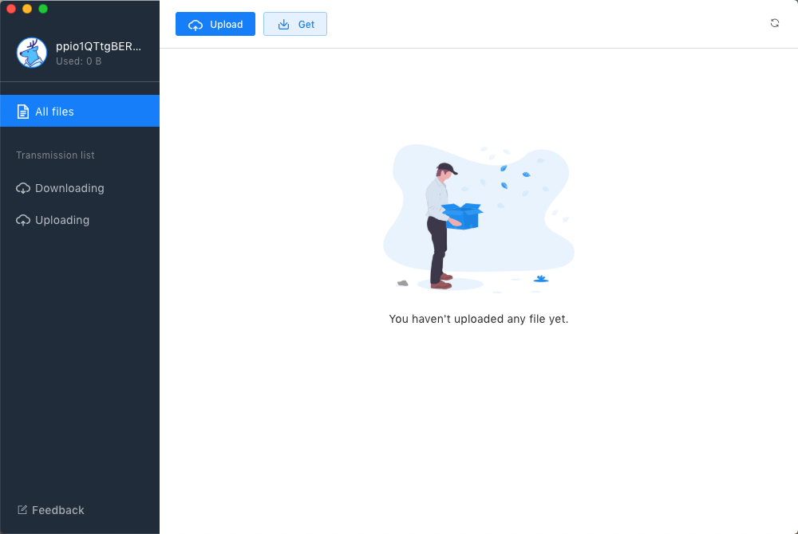
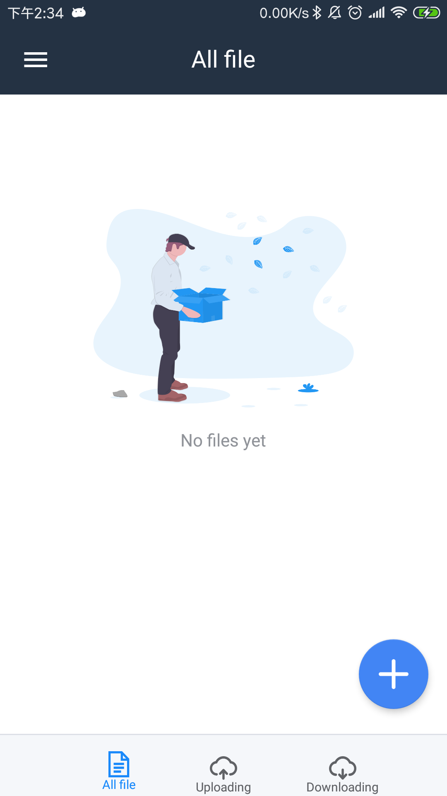

# How to use PPIO demo app

## Overview
PPIO demo is our official decentralized personal cloud storage application based on PPIO.

Before using the app, you must generate a PPIO wallet account, save the keystore file and passphrase. These are the credentials for your PPIO wallet account and the app.

## Step1: Generate a PPIO wallet account and get the keystore file
> PPIO wallet is a blockchain wallet. Also, if you don't understand the concept of blockchain wallet, there will be many articles on Google.

Go to [PPIO wallet](https://wallet.testnet.pp.io/#/new/create) to generate a PPIO wallet account. And this account can be used not only in the demo app but also [PPIO CLI](./cli/) and [PPIO SDK](./sdk/).

**create a PPIO wallet account**  

**get your PPIO wallet address**  

  

**get the keystore file and private key of the account**  

  

Now you have got your wallet keystore file.

## Step2: Get some test coins for free
Now there is no coin in your PPIO wallet. You need to go to [our faucet](https://faucet.testnet.pp.io) to get some of our test coins for free.
  

- Enter your PPIO address to generate the content you may post.
- Post the content to Twitter.
- Copy-paste the posts URL of the tweet.
- Click the “Give me PPIO coin” button to get 1 free PPIO coin for testnet!

## Step3: Send test coins to ppio demo app
Although you already have test coins in your PPIO wallet,  you also need to go back to [PPIO wallet page](https://wallet.testnet.pp.io) to recharge some PPIO coins. This involves our underlying system architecture. We will introduce these details in a later article.   

## Step4: Import your keystore file or private key to log in PPIO demo app
**log in desktop client**

**log in Android client**

## Step5: You can use PPIO demo app now!
PPIO demo app has the following features.
- upload & download file (Support breakpoint transmission)
- drag & drop file upload
- share file
- get the file by share code

It should be noted that since this demo is entirely decentralized. There are some differences between the use and the cloud storage you have used before. If you encounter some problems, you can give feedback to this email **(feedbacks@pplabs.org)**.

**desktop client**

**log in Android client**

::: warning NOTE
Due to our decentralized architecture, even with the same account, their file information cannot be synchronized when logging in to different clients. We will optimize this in later versions.
:::
